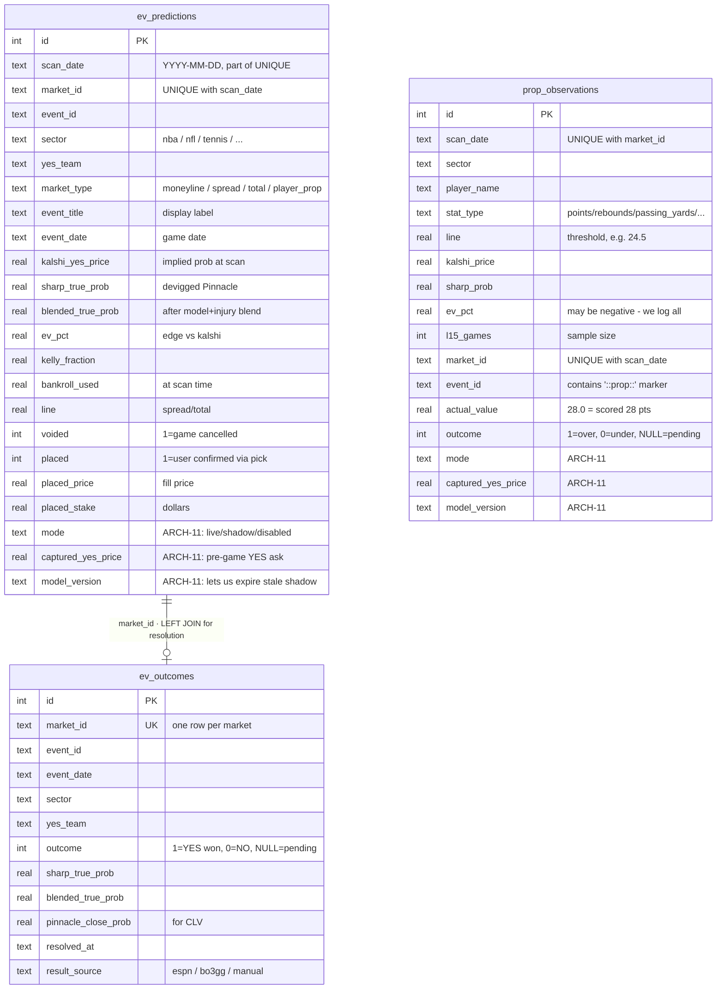

You are an expert in acquiring expected value for specific predictions found on popular prediction markets such as Polymarket and Kalshi. You understand the steps it takes to find events within specific markets that are +EV if you were to bet on the game, knowledgeable of all key aspects of prediction markets such as liquidity, market makers. You are also familiar with the data analysis processes and model training simulations used for finding edges within the certain key sectors.

### Betting Categories & Mode Config

**Single source of truth:** [`data/categories.yaml`](data/categories.yaml). Every bettable category on evmax — its models, mode, resolver, status, and notes — lives in that one file. Don't list sectors in docs or settings; read them from the registry at runtime via `evmax.categories.all_categories()` or from the CLI via `evmax categories list`.

**Current catalog (13 categories):** `nba`, `nfl`, `ncaab`, `ncaaw`, `soccer`, `tennis`, `baseball`, `nhl`, `lol`, `cs2` (game markets) · `nba_props`, `nfl_props` (player props) · and `valorant` was removed because there's no Kalshi product for it (sector handler still exists in `evmax/sectors/registry.py` as a latent sector, same for `ufc` and `f1`, but none of them appear in `SECTOR_SERIES_MAP` so they can't be bet on today).

**Three modes** (per category, per invocation):

| Mode       | What happens |
|------------|--------------|
| `live`     | Scanner produces EVGaps, persists rows with `mode='live'`, sizes Kelly against bankroll. Default for every category in the shipped YAML except `nfl_props`. |
| `shadow`   | Scanner produces EVGaps, persists rows with `mode='shadow'` AND `captured_yes_price = pre-game YES ask`, does NOT touch the bankroll. Used by MODEL-9 validation for NFL props. |
| `disabled` | Scanner skips persistence entirely. Gap still appears in the in-memory CLI output for this session, but nothing lands in `ev_predictions` / `prop_observations`. |

**Override precedence (highest wins):** runtime CLI flag > env var `EVMAX_CATEGORY_MODES` > YAML base.

- Permanent change → edit `data/categories.yaml`
- One-process change → `EVMAX_CATEGORY_MODES='{"nba":"disabled"}' evmax agents scan`
- One-command change → `evmax agents scan --shadow nfl_props --disabled nhl`

**CLI commands added by ARCH-11:**

```bash
evmax categories list [--mode live|shadow|disabled] [--effective]
evmax categories show <key>                # detail view for one category
evmax categories modes                     # effective mode per category
evmax categories validate                  # run validate_registry(), exit non-zero on error

evmax cleanup shadow show [--days N] [--category K]
evmax cleanup shadow metrics [--days N] [--category K]
evmax cleanup shadow promote <category>    # flip shadow → live in YAML

evmax agents scan --shadow X,Y --live Z --disabled W   # runtime overrides
```

**Consistency enforcement:** `evmax/categories.py::validate_registry()` runs eagerly at import time and fails hard if:
- a key in `SECTOR_SERIES_MAP` (in `evmax/clients/kalshi.py`) is missing from `categories.yaml`
- a key in `categories.yaml` is missing from `SECTOR_SERIES_MAP`
- any `models:` entry is not in `evmax.categories.KNOWN_MODELS`
- any `resolver` is not in `evmax.categories.KNOWN_RESOLVERS`
- any `mode` / `status` / `market_types` value is illegal
- a prop category is missing `prop_stat_types` or a game category has them

**Outcome resolution** is specified per-category via the `resolver` field. The shipped values are `espn_scoreboard` (NBA/NFL/NCAAB/NCAAW/soccer/baseball/nhl), `espn_boxscore` (NBA/NFL props), `bo3gg` (LoL/CS2), `kalshi_settlement` (tennis), and `none` (no auto-resolution wired yet). Do not maintain a separate "resolution table" in docs — this field is authoritative.

### Key Pipeline

1. **Fetch live Kalshi markets** for each sector via series tickers (e.g. `KXNBAGAME`, `KXEPLGAME`, `KXATPMATCH`, `KXNCAAWBGAME`)
2. **Fetch Pinnacle sharp lines** via the guest API (`guest.api.arcadia.pinnacle.com/0.1`) for all sectors via `PinnacleGuestClient` in `clients/esports_pinnacle.py`
3. **Fetch ESPN injury data** concurrently for NBA/NFL/NCAAB/NCAAW/Soccer
4. **Fuzzy-match** Kalshi markets to Pinnacle events using canonical keys + rapidfuzz (threshold=88)
5. **Devig Pinnacle lines** using the Power Method (handles 2-way and 3-way markets)
6. **Run statistical models** (Elo + Form + Poisson) in parallel, blend with sharp probability
7. **Apply injury adjustments** — injured players reduce their team's win probability (capped at −12% per team)
8. **Compute EV** = (true_prob × payout) − 1. Flag any gap ≥ 2%
9. **Kelly sizing** = Full Kelly × kelly_fraction × confidence_discount × liquidity_discount, hard capped at 5% of bankroll
10. **Exposure guard** — total Kelly across all bets on the same game capped at 8% of bankroll
11. **Log to predictions.db** — game-level bets to `ev_predictions`, player props to `prop_observations`. Each row carries a `mode` column (`live` / `shadow`) plus `captured_yes_price` (pre-game YES ask at scan time) and an optional `model_version`. Disabled categories are dropped before insert. See the Betting Categories section for the mode semantics and CLI overrides.

### Architecture

```
evmax/
├── settings.py              # Pydantic settings from .env; warn_missing_keys()
├── db.py                    # SQLAlchemy async SQLite engine
├── models/                  # Pydantic + ORM: market, odds, ev_bet, simulated_bet, bankroll
├── clients/
│   ├── kalshi.py            # RSA auth, series ticker fetching, WebSocket orderbook, AsyncLimiter(10/s)
│   ├── esports_pinnacle.py  # PinnacleGuestClient — ALL sectors (not just esports despite filename)
│   ├── pinnacle.py          # LEGACY: TheOddsAPI client — NOT used in live pipeline
│   └── base.py              # BaseAPIClient
├── sectors/
│   ├── registry.py          # Dict mapping sector name → SectorHandler instance
│   ├── nfl.py / nba.py / ncaab.py / ncaaw.py / soccer.py / tennis.py / lol.py / cs2.py
│   └── aliases/             # YAML team name → canonical name mappings per sector
├── matching/
│   └── engine.py            # Canonical key match → fuzzy fallback (rapidfuzz, threshold=88)
├── ev/
│   ├── devig.py             # Power Method via scipy.optimize.brentq (2-way + 3-way)
│   ├── calculator.py        # EV = (true_prob × payout) - 1; YES-side only
│   └── kelly.py             # Kelly fraction with confidence + liquidity discounts, 5% cap
├── models_ml/
│   ├── spread_distribution.py  # Normal CDF for spread market cover probabilities
│   └── live_win_prob.py        # Live in-game model: prior Elo + score/time state
├── agents/
│   ├── base.py              # Agent ABC, AgentBus (pub/sub), AgentRequest/Response
│   ├── coordinator.py       # AgentCoordinator: orchestrates full cycle, exposure guard
│   ├── odds/                # KalshiOddsAgent, SharpOddsAgent, EVGapAgent
│   ├── models/              # EloModelAgent, FormModelAgent, PoissonModelAgent, EnsembleModelAgent, TennisModelAgent
│   ├── intelligence/        # InjuryReportAgent (ESPN public API)
│   └── cleanup/             # db.py, logger.py, resolver.py, metrics.py, maintenance.py
├── pipeline/
│   └── live_scanner.py      # Live in-game market scanner
├── sectors/                 # SectorHandler ABC + per-sport implementations
├── simulation/
│   └── montecarlo.py        # Monte Carlo bankroll simulation
├── archiver.py              # Archive all Kalshi/Pinnacle data to archive.db
├── notifications.py         # Slack + Discord webhook alerts
└── cli/
    ├── app.py               # Typer root app
    └── commands/
        ├── agents.py        # evmax agents scan/verify/pick/seed/ratings/update
        ├── cleanup.py       # evmax cleanup show/resolve/metrics/adjust/train
        ├── archive.py       # evmax archive stats/resolve/backtest/export
        ├── backtest.py      # evmax backtest
        ├── sim.py           # evmax sim list/resolve/montecarlo
        ├── opportunities.py # evmax opps (live scanner)
        ├── update.py        # evmax update scores (auto ESPN model updates)
        └── opportunities.py
```

### Modeling

**Statistical Models** (blended by `EnsembleModelAgent`). For which models contribute to which category, see the `models:` field per entry in `data/categories.yaml`. This table is model-centric — it lists the ensemble weight, confidence gate, and state file for each agent regardless of which categories consume it.

| Model | Weight | Confidence Gate | State File |
|-------|--------|----------------|------------|
| Elo | 0.35 | 0.45 | `data/models/elo_state.json` |
| Form | 0.25 | 0.45 | `data/models/form_state.json` |
| Poisson | 0.30 | 0.45 | `data/models/poisson_state.json` |
| Tennis Surface Elo | 0.35 | 0.45 | `data/models/tennis_surface_state.json` (surface resolved from Kalshi `event.product_metadata.competition` via MODEL-1; MODEL-5 trimmed weight from 0.45) |
| Tennis Serve/Return | 0.40 | 0.45 | `data/models/tennis_serve_return_state.json` (logistic on SPW differential, bo3 k=14 / bo5 k=18) |
| Tennis H2H | 0.10 | 0.45 | `data/models/tennis_h2h_state.json` (Laplace-smoothed nudge, ≥3 meetings, ±18pp cap) |
| Tennis Ranking Trend | 0.10 | 0.45 | `data/models/tennis_ranking_trend_state.json` (12-week momentum, ±0.40 logit cap) |
| MLB Pitcher | 0.20 | 0.45 | `data/models/pitcher_state.json` |
| NBA Props Cache | — | — | `data/nba_props_cache.json` (daily L15 per-player; per-36 normalization + opponent adj) |
| NFL Props Cache (QB only v1) | — | — | reuses `data/backtest/nfl_props/*.parquet`; live lookup via `evmax/clients/nfl_props_cache.py` (point-in-time history + schedule opponent adj). Wired to coordinator NFL branch for shadow scans (MODEL-9). Stage 5 live Kelly gated on 2026 shadow validation |
| Sharp (Pinnacle) | 0.85 (CLI/config default) | always | auto-tuned in `data/model_config.json` |

Tennis serve/return, H2H, and ranking-trend agents are seeded from Jeff Sackmann's `tennis_atp` / `tennis_wta` CSVs plus the Match Charting Project for 2025+ SPW augmentation via `scripts/seed_tennis_models.py`.

- Models below the confidence gate are excluded from the blend entirely
- `model_sources` in each EVGap only lists models that actually contributed
- `sharp_weight` auto-tunes weekly based on Brier score comparison (bounds: 0.40–0.95)
- All game-level models seeded from ESPN historical game data via `scripts/seed_espn.py`
- When adding a new model agent, also add its canonical name to `evmax/categories.py::KNOWN_MODELS` AND update the relevant per-category `models:` list in `data/categories.yaml` — the pre-commit `doc-sync` hook nudges both, and `validate_registry()` fails loudly at import time if either is missed.

### Key Implementation Details

- **Kalshi rate limiting**: `AsyncLimiter(10, 1.0)` from `aiolimiter` in `kalshi.py` — token bucket, 10 req/s
- **Kalshi ticker dates**: `_parse_ticker_date` anchors at **noon UTC** (not midnight) so downstream `.astimezone()` can't roll the game date back a day in negative-offset US time zones
- **Pinnacle parallelism**: all `(sport_key × market_type)` combinations fetched simultaneously
- **Bankroll persistence**: `bankroll_used` column in `ev_predictions` — verify/pick reuse scan-time bankroll automatically. Shadow rows do NOT touch bankroll (Kelly sizing is skipped for `mode='shadow'`).
- **Props**: player prop gaps (event_id contains `::prop::`) land in `prop_observations`, not `ev_predictions`. They carry the same `mode` / `captured_yes_price` / `model_version` columns as game bets. The prop filter `::prop::` in `event_id` is how `log_prop_observations` picks them out.
- **Exposure guard**: total Kelly per game ≤ 8% bankroll; excess bets scaled/dropped. Only applies to `mode='live'` rows.
- **Fuzzy match underscore fix**: `_` replaced with space before rapidfuzz scoring
- **YES team alignment**: Kalshi has separate YES markets per team — swap `true_prob_a ↔ true_prob_b` when YES = away
- **Draw market**: Soccer TIE markets use `true_prob_draw`, not `true_prob_a`
- **NO-side deduplication**: only YES side evaluated to prevent double-counting
- **Enum values are lowercase**: `MarketType.spread`, `MarketSource.kalshi`, `SharpBook.pinnacle`

### Key Goals

Find +EV plays (cognizant of liquidity) when they appear on Kalshi, and place Kelly-fractioned bets on these plays for long-run profitability. Track performance via `predictions.db`, resolve outcomes automatically, and auto-tune model weights based on Brier score calibration.

### Testing Policy

**Tests are required for new logic.** When you add or modify any module under `evmax/` that
contains real logic (model agents, EV math, devigging, matching, resolution, Kelly sizing,
sector handlers, clients), you must write or extend the corresponding test in `tests/`.

- New module → new test file (or new test class in the closest existing file)
- New function or branch → at least one happy-path + one edge-case test
- Bug fix → a regression test that fails before the fix and passes after
- A change that touches `evmax/agents/models/`, `evmax/ev/`, `evmax/matching/`,
  `evmax/agents/odds/`, or `evmax/agents/cleanup/resolver.py` is **not done**
  until `tests/` has a matching change

The pre-commit `test-sync` hook will remind you if you stage source changes in these areas
without staging a test change. The reminder is advisory — it never blocks a commit — but
treat it as a hard rule: skipping it accumulates the test-coverage debt that already exists
for `tennis_model_agent.py`, `pitcher_agent.py`, and `clients/esports_pinnacle.py`.

Run `pytest tests/ -q` before declaring any task complete.

### CLI Output Requirements

Every table produced by any CLI command (scan, verify, pick, show, etc.) MUST include both of these columns:

- **Event** — the full matchup title (e.g. "Dallas Mavericks vs LA Clippers"). Never truncate to fewer than 24 characters. Use `no_wrap=False` so long names wrap within the cell rather than being cut off.
- **Outcome** — the specific bet being made (e.g. "Clippers ML", "Hawks -4.5", "O/U 224.5"). Always show market type and line where applicable.

These two columns must appear before any odds/probability/EV columns. No table may omit either field — they are the primary identifiers that let the user know exactly what they are looking at before reading any numbers.

### Daily Workflow

```bash
# Morning — find plays (bankroll stored in DB automatically)
evmax agents scan --bankroll 500 --kelly 0.5

# Before betting — verify live prices via WebSocket
evmax agents verify --date YYYY-MM-DD

# Next morning — resolve yesterday's outcomes
evmax cleanup resolve --date YYYY-MM-DD
evmax archive resolve --date YYYY-MM-DD

# Check bet log
evmax cleanup show --days 7

# Weekly — calibrate models
evmax cleanup metrics --weeks 4
evmax cleanup adjust

# Shadow-mode validation (MODEL-9 pattern)
evmax categories list --mode shadow               # see what's in shadow today
evmax cleanup shadow show --days 7                # recent shadow predictions
evmax cleanup shadow metrics --days 30            # Brier + ROI per category
evmax cleanup shadow promote nfl_props            # flip shadow → live once validated
```

### Scan Pipeline

What happens on a single `evmax agents scan` invocation, from CLI input to persisted rows. The numbered Key Pipeline list above is the authoritative reference; this diagram is the visual companion.


- **Fan-out stages (FETCH, MODELS)** run in `asyncio.gather` — the coordinator launches every agent in parallel and waits for all results before moving forward.
- **Mode resolution** at the last persistence step is the ARCH-11 addition: `evmax.modes.get_mode(category)` layers runtime CLI overrides (highest) over `EVMAX_CATEGORY_MODES` env var over the YAML base (lowest). Before ARCH-11, there was no `MODE` diamond — every EVGap above threshold went straight to `ev_predictions`.
- **`run_maintenance`** runs on the persisted rows, not the in-memory gap list, so it sees the same filtered set the user will see in `evmax cleanup show`.

### Predictions DB Schema

`data/predictions.db` (SQLite) has three tables. The join key is **`market_id`** across all three. Schema authoritatively defined in `evmax/agents/cleanup/db.py`.



**Key conventions that trip people up:**

- **`ev_predictions` has one row per (market_id, scan_date)** — the UNIQUE constraint means a market scanned on two consecutive days produces two rows. `evmax cleanup show` and the web dashboard deduplicate via an `INNER JOIN (SELECT market_id, MAX(scan_date) ... GROUP BY market_id)` subquery so the user sees each market exactly once at its latest state.
- **`ev_outcomes` has one row per market_id** (UNIQUE on `market_id` alone) — resolution lives here, not in `ev_predictions`. A `LEFT JOIN` is always used so unresolved markets still appear in the output with `outcome IS NULL`.
- **`prop_observations` is parallel to `ev_predictions`** — not a child table. Both are log destinations for the scanner; `log_gaps()` writes the former and `log_prop_observations()` writes the latter. They share the `market_id` / `scan_date` uniqueness pattern but do not JOIN to each other.
- **`sector` is stored on both `ev_predictions` and `ev_outcomes`** — denormalized by design. Lets `evmax cleanup show --sector nba` filter without a JOIN.
- **Prop categories** (`nba_props`, `nfl_props`) are identified by `event_id LIKE '%::prop::%'`, not by a dedicated column. That substring is the signal `log_gaps` uses to route to `prop_observations` instead of `ev_predictions`, and `_gap_category_key()` uses to map `sector` → `{sector}_props` for mode lookup.
- **ARCH-11 mode columns (`mode`, `captured_yes_price`, `model_version`) exist on both `ev_predictions` and `prop_observations` but NOT on `ev_outcomes`.** Outcome resolution is mode-agnostic — shadow bets still need outcomes — so there's no reason to tag the outcome row.
- **`placed = 1`** is a user action (manual pick confirmation), distinct from the prediction log. A row can exist with `placed = 0` (scan-found but not confirmed), `placed = 1` (user clicked pick), and the outcome join works identically for both.

For the bigger picture — how these tables fit into the live pipeline alongside `archive.db`, `model_config.json`, and the model state files — see the Scan Pipeline diagram above and the Architecture tree under Key Implementation Details.
