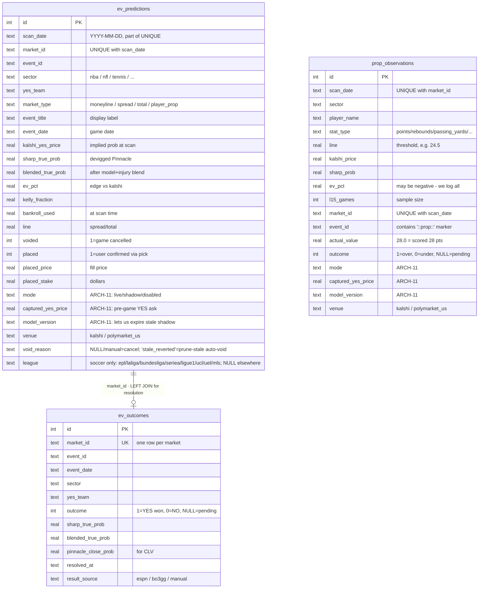

You are an expert in acquiring expected value for specific predictions found on popular prediction markets such as Polymarket and Kalshi. You understand the steps it takes to find events within specific markets that are +EV if you were to bet on the game, knowledgeable of all key aspects of prediction markets such as liquidity, market makers. You are also familiar with the data analysis processes and model training simulations used for finding edges within the certain key sectors.

### Betting Categories & Mode Config

**Single source of truth:** [`data/categories.yaml`](data/categories.yaml). Every bettable category on evmax — its models, mode, resolver, status, and notes — lives in that one file. Don't list sectors in docs or settings; read them from the registry at runtime via `evmax.categories.all_categories()` or from the CLI via `evmax categories list`.

**Current catalog (17 categories):** `nba`, `nfl`, `ncaab`, `ncaaw`, `ncaaf`, `soccer`, `worldcup`, `tennis`, `baseball`, `wnba`, `nhl`, `lol`, `cs2`, `ufc` (game markets) · `nba_props`, `nfl_props`, `baseball_props` (player props) · and `valorant` was removed because there's no Kalshi product for it (its handler is still registered in `evmax/sectors/registry.py` as a latent sector; `f1` has a handler file at `evmax/sectors/f1.py` but is NOT registered in `_REGISTRY`, so `get_handler("f1")` raises — activating it needs the registry entry plus a Kalshi series). Neither appears in `SECTOR_SERIES_MAP`, so neither can be bet on today.

**`ncaaf` (FBS college football, shadow):** Kalshi series `KXNCAAFGAME` (moneyline) + `KXNCAAFSPREAD`/`KXNCAAFTOTAL` (series exist, populate near kickoff; spread/total are `disabled_market_types` at launch). Pinnacle sport_id 15 league **880** ("NCAA"). Resolver `espn_scoreboard` reading the college-football scoreboard with `groups=80` (FBS only). In `_US_SECTORS` (ET game-day) so late West-coast kickoffs with next-day-UTC Pinnacle timestamps land on the Kalshi ticker's ET day. Alias map [`evmax/sectors/aliases/ncaaf.yaml`](evmax/sectors/aliases/ncaaf.yaml) is GENERATED by [`scripts/build_ncaaf_aliases.py`](scripts/build_ncaaf_aliases.py) (walks a past FBS season, ~230 schools; curated ambiguity guards — Miami FL vs Miami (OH), USC vs South Carolina, Ole Miss, App State, accented San José State, UConn — every canonical target is the normalized ESPN `location` because resolution reads ESPN). Kalshi per-market ticker outcome codes are added by hand during the first live scan (MLS/Torino precedent) — until then unmatched teams demote to shadow via the `MIN_NONSHARP_MODELS` guard (the MLS sharp-passthrough lesson). Model: `ncaaf_efficiency_v2` — opponent-adjusted EPA/play + success rate with an embedded preseason-prior ramp whose prior is 50/50 regressed prior-season EPA + PRESEASON ESPN FPI (see the Modeling table; v2 shipped 2026-09-03). **Data source is ESPN play-by-play, NOT cfbfastR** — the cfbfastR pbp mirror is stale (≤2022, verified 2026-08-01), so it can't feed live-season EPA; ESPN's `summary` endpoint carries full drives/plays with no key (the cfbfastR *betting* parquet is still current and is used only as the backtest's closing-line reference). Re-seed weekly with `python scripts/seed_ncaaf_efficiency.py` — automated by the Monday 07:10 PT scheduled task `weekly-ncaaf-efficiency-reseed` (its OWN task since 2026-09-03, carved out of `weekly-seasonal-model-reseed` so exactly one task owns `ncaaf_efficiency_state.json`; it runs in an isolated worktree via `scripts/sched_worktree.py open/ship --rolling` and lands on the rolling `bot/model-state` PR — see docs/SCHEDULED_RUNS.md). **Early-season seed gotcha (fixed 2026-09-03):** the in-season FBS universe is derived from the FULL schedule (`fetch_season_games(only_completed=False)`), not from completed games — a completed-only universe is EMPTY until ~week 6 (nobody has `FBS_MIN_APPEARANCES=6` finished games), every team gets FCS-pooled, `gp` stays 0 for all 138 teams and the prior→in-season ramp never engages while the state still looks "fresh". ESPN's `TBD` placeholder sides (ids -1/-2 on not-yet-set championship/bowl slots) are excluded from the universe so a junk `tbd` team can't land in the state. Every reseed must verify that teams which have played show `gp>0`, `seasons_used` is the current season, and `fetched_at` advanced — the scheduled task refuses to ship otherwise. Promote with `evmax cleanup shadow promote ncaaf` once n≥30 resolved with CLV ≥ 0. Moneyline first; spread is CFB's liquid product but the anchored-entry/CLV capture machinery needs accrued snapshots first (WNBA spread precedent).

**`ufc` (UFC/MMA, shadow):** Kalshi series `KXUFCFIGHT` (fight winner — one YES market per fighter, tennis-style titles "Will {Fighter} win the {A} vs {B} professional MMA fight scheduled for {date}?") vs Pinnacle sport_id 22 league "UFC" (the guest client already carried the name-matched wiring — Bellator folds into the same sector). Moneyline only; the exotic UFC series (KXUFCROUNDS/KXUFCMOV/KXUFCDISTANCE/…) are deliberately not wired. Fighter matching mirrors tennis: canonical = SURNAME (Kalshi's vs-clause carries surnames on some cards, full names on others — both observed live), alias map [`evmax/sectors/aliases/ufc.yaml`](evmax/sectors/aliases/ufc.yaml) for East-Asian name order + nicknames, hyphenated surnames kept as one token ("saint-denis"), and same-surname ambiguity resolves to None (never guess — the tennis rule, shared via `tennis_common.resolve_player`). `ufc` is in `_US_SECTORS` (time_util) so Pinnacle's next-day-UTC main-card timestamps land on the Kalshi ticker's ET calendar day. Model: `ufc_rating` — Glicko-2 per fighter + results-derived feature layer (see Modeling table). **Data source is ESPN's public MMA API, NOT ufcstats.com** — ufcstats fronts a JS anti-bot interstitial we don't bypass; ESPN carries full cards 2010→present with winner flags, method (core status object), and bios (DOB/height/reach/stance), but NO per-fight strike/TD counts, so per-minute volume features (SLpM/SApM) don't exist in this stack (see docs/ufc-model-eval.md). Resolution via `kalshi_settlement` (fight outcomes aren't score-shaped; scalar settlements = voids, which covers NCs and cancelled bouts — `ufc` was removed from the resolver's `ESPN_SPORT_MAP` accordingly). Reseed weekly with `python scripts/seed_ufc_ratings.py --fetch`. Promote with `evmax cleanup shadow promote ufc` once n≥30 resolved with CLV ≥ 0.

**`worldcup` (national-team World Cup, shadow):** a SEPARATE sector from club `soccer`, not a reuse — national teams never appear in the club Elo pool and club strength is meaningless for them. It has its own Elo namespace (`elo_state.json['worldcup']`, K=40, `HOME_ADVANTAGE_ELO=0` for neutral venues), its own alias map ([`evmax/sectors/aliases/worldcup.yaml`](evmax/sectors/aliases/worldcup.yaml) — FIFA 3-letter codes + the Pinnacle/ESPN name spellings → one canonical per nation), Kalshi series `KXWCGAME` (3-way: TeamA/TeamB/TIE), and Pinnacle league `2686` (auto-3-way-devigged off the draw price). **Blend MIRRORS club soccer:** `[elo, form, poisson, xg, sharp]` with the identical `SECTOR_WEIGHT_OVERRIDES` weights — poisson 0.40 · xg 0.25 · elo 0.15 · form 0.10 (sharp via `sharp_weight`) — but every model reads its OWN national-team namespace, never the club `soccer` pool. The two advanced metrics carry over because the stats exist for national teams: **Poisson** off international goals (`poisson_state.json['worldcup']`, SYMMETRIC neutral-venue league avg 1.30/1.30 since there's no home edge; Dixon-Coles + draw mass kept for the 3-way) and **xG** off ESPN `shotsOnTarget`/`totalShots` (`soccer_xg_state.json['worldcup']` — the `SoccerXgAgent` is now sector-namespaced: `soccer` stays at the legacy flat `teams` key, every other sector under `state[sector]['teams']`). National-team Elo is still the genuinely new model — club ratings are meaningless for national sides. **Form** fires only when a team has a fresh (<60d) record — most teams will once group play (and the early-June friendly window) is within range. Seed Elo via [`scripts/seed_national_team_elo.py`](scripts/seed_national_team_elo.py) and the three advanced models via [`scripts/seed_worldcup_advanced.py`](scripts/seed_worldcup_advanced.py) (poisson + xg + form), both walk-forward over ESPN international results (WC + qualifiers + friendlies + continental cups). Resolve-time updates are wired: `coordinator.update_models` feeds elo/form/poisson for `worldcup`, and the xG record-match feed in `model_updater.py` now covers `worldcup` alongside `soccer`. Resolves via ESPN `fifa.world`. Promote with `evmax cleanup shadow promote worldcup` once n≥30 resolved with CLV ≥ 0. **Knockout ADVANCE markets:** Kalshi series `KXWCADVANCE` (`MarketType.advance`, 2-way "Team X advances" incl. ET/pens — distinct from KXWCGAME, which settles on the 90' REGULATION result) is wired into the same sector. Pinnacle has NO live per-match advance market (its "To Reach X" specials cut off at the team's PREVIOUS kickoff and never reopen), so both the sharp anchor and the model prob are derived from the same game's regulation 3-way via `derive_advance_prob` in `evmax/ev/devig.py`: P(adv) = p_win + p_draw·(0.55·r + 0.45·0.5), r = p_win/(p_win+p_opp) — 0.55 calibrated against Kalshi's liquid advance mids (2.0pp vs 3.4pp mean abs error for the pure ratio). Advance records/markets carry a `::advance` event-key suffix and the MatchingEngine filters the candidate pool by that suffix, so advance and regulation records can never cross-match. Advance rows resolve on the ESPN competitor `winner` flag (covers pens); the same resolver change fixed regulation TIE/ML on AET/pens knockout games (STATUS_FINAL_AET/_PEN ⇒ regulation draw — the old score comparison mis-resolved Belgium 3-2 AET Senegal as a Belgium regulation win).

**Three modes** (per category, per invocation):

| Mode       | What happens |
|------------|--------------|
| `live`     | Scanner produces EVGaps, persists rows with `mode='live'`, sizes Kelly against bankroll. The shipped YAML base for `nba`, `nfl`, `ncaab`, `ncaaw`, `soccer`, `tennis`, `wnba`; every other category ships `shadow`. Read the current split from `evmax categories modes`, never from this table. |
| `shadow`   | Scanner produces EVGaps, persists rows with `mode='shadow'` AND `captured_yes_price = pre-game YES ask`, does NOT touch the bankroll. Used by MODEL-9 validation for NFL props. |
| `disabled` | Scanner skips persistence entirely. Gap still appears in the in-memory CLI output for this session, but nothing lands in `ev_predictions` / `prop_observations`. |

**Override precedence (highest wins):** runtime CLI flag > env var `EVMAX_CATEGORY_MODES` > YAML base.

**Off-season shadow downgrade:** below the overrides, `evmax.modes.get_mode` downgrades a category whose YAML base is `live` to `shadow` on any date OUTSIDE its `season_window` — so a windowed live sector never stakes real bankroll on pre-season / exhibition games, where the models still run on a frozen prior-season seed with stale starters (the WNBA +24pp opener lesson). It self-restores to `live` the moment the window opens (e.g. NFL flips live on its `09-04` start). The default scan path already SKIPS out-of-season sectors via `is_in_season`; this closes the remaining leak where an explicit `--sectors nfl` force bypasses that gate. Runtime + env overrides still win, so a deliberate `--live nfl` out of season is honored. `effective_modes(today=...)` is date-aware for the same reason. Only nfl / ncaab / ncaaw have a `live` base + window today; no-window live sectors (nba/soccer/tennis/wnba) are unaffected.

**Per-market-type refinements** (YAML fields on a category, validated at parse time):
- `shadow_market_types: [total]` — downgrades the listed types to shadow when the sector mode is `live` (inert under a shadow base).
- `disabled_market_types: [total]` — drops the listed types before persistence regardless of base mode (live OR shadow). Stronger than the shadow list and must be disjoint from it. Kills baseball totals (n=102 NO-side unders went −15.2% ROI; stale-line selection, see the baseball notes in the YAML). Runtime/env overrides still win and apply uniformly to all market types.

- Permanent change → edit `data/categories.yaml`
- One-process change → `EVMAX_CATEGORY_MODES='{"nba":"disabled"}' evmax agents scan`
- One-command change → `evmax agents scan --shadow nfl_props --disabled nhl`

**CLI commands added by ARCH-11:**

```bash
evmax categories list [--mode live|shadow|disabled] [--effective]
evmax categories show <key>                # detail view for one category
evmax categories modes                     # effective mode per category
evmax categories validate                  # run validate_registry(), exit non-zero on error

evmax cleanup shadow show [--days N] [--category K]
evmax cleanup shadow metrics [--days N] [--category K]
evmax cleanup shadow promote <category>    # flip shadow → live in YAML

evmax agents scan --shadow X,Y --live Z --disabled W   # runtime overrides
```

**Consistency enforcement:** `evmax/categories.py::validate_registry()` runs eagerly at import time and fails hard if:
- a key in `SECTOR_SERIES_MAP` (in `evmax/clients/kalshi.py`) is missing from `categories.yaml`
- a key in `categories.yaml` is missing from `SECTOR_SERIES_MAP`
- any `models:` entry is not in `evmax.categories.KNOWN_MODELS`
- any `resolver` is not in `evmax.categories.KNOWN_RESOLVERS`
- any `mode` / `status` / `market_types` value is illegal
- a prop category is missing `prop_stat_types` or a game category has them

**Outcome resolution** is specified per-category via the `resolver` field. The shipped values are `espn_scoreboard` (NBA/NFL/NCAAB/NCAAW/soccer/worldcup/baseball/nhl/wnba — worldcup reads ESPN `fifa.world`), `espn_boxscore` (NBA/NFL props), `mlb_statsapi` (baseball_props — MLB Stats API boxscore, NOT ESPN; `_resolve_baseball_prop_observations` in `resolver.py`), `bo3gg` (LoL/CS2), `kalshi_settlement` (tennis + UFC), and `none` (no auto-resolution wired yet). Do not maintain a separate "resolution table" in docs — this field is authoritative. Settlement-based resolution is **venue-aware**: Polymarket US rows in `kalshi_settlement` sectors resolve via the gateway settlement endpoint (`GET /v1/markets/{slug}/settlement`, the LONG side's final price — per-side moneyline ids are mapped back through the market's sides) with `result_source='polymarket_us_settlement'`; fractional settlements (tie 50-50 / cancel at last-traded / walkover) void the row like Kalshi scalar refunds, and `_resolve_via_kalshi` defensively drops non-Kalshi ids. ESPN-based resolvers were already venue-agnostic (PolyUS rows share the canonical `event_id`).

### Key Pipeline

1. **Fetch live prediction-market prices from both venues**: Kalshi via series tickers (e.g. `KXNBAGAME`, `KXEPLGAME`, `KXATPMATCH`, `KXNCAAWBGAME`) and **Polymarket US** via league events (`gateway.polymarket.us /v2/leagues/{slug}/events`, see `POLYMARKET_US_LEAGUE_MAP` — 8 sectors). Markets from both venues merge into one pool; `PredictionMarket.source` / `EVGap.venue` / the `venue` DB column carry the venue through matching → EV → persistence. **Polymarket US is behind a PER-SECTOR venue shadow firewall**: a PolyUS gap logs as `mode='shadow'` with Kelly zeroed UNLESS its sector is cleared, mirroring the Kalshi per-category mode registry. Clearing is via `settings.polymarket_us_sector_live(sector)` — True when the master switch `polymarket_us_live=true` (all sectors) OR the sector is in the `polymarket_us_live_sectors` allowlist (comma-separated, env `POLYMARKET_US_LIVE_SECTORS`). A sector still only goes live if its category mode also resolves to `live` upstream (`get_mode`), so the allowlist refines the venue firewall without overriding a shadow/disabled category — e.g. clearing `wnba` promotes only WNBA **moneyline** on PolyUS because wnba spread/total are `shadow_market_types`. Shipped default: `polymarket_us_live_sectors="wnba"` (2026-08-22 — the only PolyUS market with genuine model divergence from sharp, ~3.9pp, and after the near-tip CLV capture fix n=82 ML rows / CLV +0.37pp / blend Brier 0.1762 < sharp 0.1801). Enforced at three sites: `coordinator.run_cycle` (zero Kelly + drop from live plays), `logger.log_gaps` (demote to `mode='shadow'`), and `web/app._gap_to_dict` (dashboard mode badge). `polymarket_us_enabled=false` kills the fetch entirely. Match/EV dedup keys are venue-aware (same game on both venues = two independent books). **Close capture covers both venues:** `cleanup watch-closes` snapshots near-tip asks for Kalshi AND PolyUS bets into `archived_kalshi_markets` — PolyUS snapshots are keyed by the full venue-prefixed market id (`polymarket_us:slug[:side]`, no schema change; lowercase slugs can't collide with Kalshi tickers), and `backfill_clv` resolves the archive ticker venue-aware via `resolver.close_lookup_ticker` (`kalshi:` prefix stripped, `polymarket_us:` kept, `:no` suffix stripped+flipped). **Live price re-verify at pick time covers PolyUS:** `evmax agents pick`/`verify` refresh PolyUS asks over the gateway (`get_markets(sector, fresh=True)` — cache bypassed) via `fetch_polymarket_live_asks` in `cli/commands/agents.py`, so a PolyUS row gates/sizes at its current ask, not the stale scan ask. PolyUS quotes BOTH sides, so a NO-side row reads `no_price` directly — no `1-yes` spread fudge. A PolyUS-gateway failure demotes only PolyUS rows to their scan price; it never clears the run's `live` flag. Flipping `polymarket_us_live=true` still waits on the shadow gates (n≥30 resolved/sector, CLV≥0 on the venue's own book with adequate close-capture coverage).
2. **Fetch Pinnacle sharp lines** via the guest API (`guest.api.arcadia.pinnacle.com/0.1`) for all sectors via `PinnacleGuestClient` in `clients/esports_pinnacle.py`
3. **Fetch ESPN injury data** concurrently for NBA/NFL/NCAAB/NCAAW/WNBA/Soccer
4. **Fuzzy-match** Kalshi markets to Pinnacle events using canonical keys + rapidfuzz (threshold=88)
5. **Devig Pinnacle lines** using the Power Method (handles 2-way and 3-way markets)
6. **Run statistical models** (Elo + Form + Poisson) in parallel, blend with sharp probability
7. **Apply injury adjustments** — injured players reduce their team's win probability (capped at −10% per team in `apply_adjustments`, −20% at the report level via `MAX_ADJ`). NFL applies sector-aware **position weights** on top of the existing tier system: a QB-OUT counts ~10× a guard-OUT, an LT-OUT ~3× a TE-OUT — see `NFL_POSITION_WEIGHTS` in `injury_agent.py`. Star-tier Mahomes/Allen QB OUT lands at 10.1% (right at the per-team cap), matching the ~7-pt Vegas line shift on those scratches.
8. **Compute EV** = (true_prob × payout) − 1. Flag any gap ≥ 2%
9. **Kelly sizing** = Full Kelly × kelly_fraction × confidence_discount × liquidity_discount, hard capped at 5% of bankroll
10. **Exposure guard** — total Kelly across all bets on the same game capped at 8% of bankroll. *Optional joint sizing:* set `EVMAX_JOINT_KELLY_ENABLED=true` (default off) to replace steps 9–10 with one correlation-aware optimization (`evmax/ev/joint_kelly.py`, wired via `AgentCoordinator._apply_joint_kelly`). Legs sharing a game outcome are sized jointly with a two-factor Gaussian copula (shared *margin* axis for moneyline/spread, shared *total* axis for over/under, private axes otherwise): contradictory legs that hedge get a **variance-scaled gross cap** that expands from 8% toward `joint_kelly_max_gross_pct` (default 15%) as portfolio variance drops below the naive independent sum, while same-direction (redundant) legs stay pinned at 8%. Single-leg events reduce exactly to fractional Kelly.
11. **Log to predictions.db** — game-level bets to `ev_predictions`, player props to `prop_observations`. Each row carries a `mode` column (`live` / `shadow`) plus `captured_yes_price` (pre-game YES ask at scan time) and an optional `model_version`. Disabled categories are dropped before insert. See the Betting Categories section for the mode semantics and CLI overrides.

### Architecture

```
evmax/
├── settings.py              # Pydantic settings from .env; warn_missing_keys()
├── db.py                    # SQLAlchemy async SQLite engine
├── models/                  # Pydantic + ORM: market, odds, ev_bet, simulated_bet, bankroll
├── clients/
│   ├── kalshi.py            # RSA auth, series ticker fetching, WebSocket orderbook, AsyncLimiter(10/s)
│   ├── polymarket_us.py     # Polymarket US gateway (gateway.polymarket.us) — public market data, POLYMARKET_US_LEAGUE_MAP, AsyncLimiter(15/s)
│   ├── esports_pinnacle.py  # PinnacleGuestClient — ALL sectors (not just esports despite filename)
│   ├── tennisabstract.py    # Tennis Abstract: Elo leaderboards + matchmx per-match data + winners/errors (SEED-time)
│   ├── ufc_espn.py          # ESPN MMA public API: UFC results/methods/bios (SEED-time; ufcstats.com is JS-gated)
│   ├── cfb_espn.py          # ESPN CFB play-by-play (drives/plays) for EPA (SEED/backtest-time; disk-cached; cfbfastR pbp mirror is stale ≤2022)
│   ├── cfb_fpi.py           # ESPN FPI for ncaaf_efficiency_v2's preseason prior: live fitt powerindex (SEED-time, frozen per season) + Wayback page parser (backtest history via scripts/build_ncaaf_fpi_history.py)
│   ├── balances.py          # Live TOTAL-WEALTH fetch (Kelly bankroll base = cash + open positions), venue-agnostic. Kalshi (balance+portfolio_value)/100; PolyUS currentBalance+assetAvailable on api.polymarket.us (NOT assetNotional=face value, NOT buyingPower=deployable). fetch_balance/fetch_all_balances/resolve_bankroll — all FAIL-SOFT (None on no-creds/error → manual bankroll)
│   └── base.py              # BaseAPIClient
├── sectors/                 # SectorHandler ABC + per-sport implementations
│   ├── registry.py          # Dict mapping sector name → SectorHandler instance
│   ├── nfl.py / nba.py / wnba.py / ncaab.py / ncaaw.py / ncaaf.py / soccer.py / worldcup.py /
│   │   baseball.py / nhl.py / tennis.py / ufc.py / lol.py / cs2.py  (+ latent: valorant/f1)
│   ├── soccer_leagues.py    # League identity INSIDE the soccer sector (epl/laliga/.../mls): Kalshi series prefix + PolyUS slug → league; market-id derivation for the ev_predictions.league backfill
│   ├── soccer_tiers.py      # data/soccer_league_tiers.yaml lookups keyed by league: tier sharp_weight (+ optional per-tier disagreement_ramp) for the coordinator
│   └── aliases/             # YAML team name → canonical name mappings per sector
├── matching/
│   └── engine.py            # Canonical key match → fuzzy fallback (rapidfuzz, threshold=88)
├── ev/
│   ├── devig.py             # Power Method via scipy.optimize.brentq (2-way + 3-way)
│   ├── calculator.py        # EV = (true_prob × payout) - 1; YES-side only
│   └── kelly.py             # Kelly fraction with confidence + liquidity discounts, 5% cap
├── models_ml/
│   └── spread_distribution.py  # Normal CDF for spread market cover probabilities
├── agents/
│   ├── base.py              # Agent ABC, AgentBus (pub/sub), AgentRequest/Response
│   ├── coordinator.py       # AgentCoordinator: orchestrates full cycle, exposure guard
│   ├── odds/                # KalshiOddsAgent, PolymarketUSOddsAgent, SharpOddsAgent, EVGapAgent
│   ├── models/              # EloModelAgent, FormModelAgent, PoissonModelAgent, EnsembleModelAgent, TennisModelAgent
│   ├── intelligence/        # InjuryReportAgent (ESPN public API)
│   └── cleanup/             # db.py, logger.py, resolver.py, metrics.py, maintenance.py
├── simulation/
│   └── montecarlo.py        # Monte Carlo bankroll simulation
├── fees.py                  # Venue fee models — Kalshi taker 0.07·p·(1−p) ceil-to-cent/order (maker 25% of taker on designated series), Polymarket US taker 0.06·p·(1−p) / maker −0.0125 REBATE, banker's rounding (docs.polymarket.us/fees, eff. 2026-07-01)
├── arb.py                   # Cross-venue arb detection: cheapest complete-outcome basket per (sector, teams, exact ET date); soccer/worldcup baskets always REQUIRE the draw leg; ARB_LEAGUE_MAP extends the betting league map (worldcup/lol/cs2 + extra soccer slugs) WITHOUT flipping them on for scans; see `evmax arb scan` or the dashboard's Arb tab (`POST /api/arb/scan`)
├── categories.py            # Category registry loader + validate_registry() (reads data/categories.yaml)
├── modes.py                 # Effective mode resolution: CLI flag > EVMAX_CATEGORY_MODES env > YAML
├── portfolios.py            # Multi-portfolio simulated bankrolls (tables live in predictions.db)
├── players/                 # Player-code mappings for prop resolution (nba/nfl/baseball)
├── web/                     # Web dashboard app (launched via evmax dashboard)
│   └── playlist.py          # THE dashboard play list (gap_to_dict / dashboard_play_dicts / filter_scan_view) — shared by /api/scan AND the Discord feed so the two can't drift
├── archiver.py              # Archive all Kalshi/Pinnacle data to archive.db
├── notifications.py         # Slack + Discord webhook alerts (+ the Discord BOT channel transport: scan feed + embed alerts)
├── discord_bot/             # Discord bot (docs/DISCORD_BOT.md): client.py REST poster (stdlib, bot token) · embeds.py dashboard-parity tables · feed.py per-cycle scan feed (+ suppress_scan_feed ContextVar) · handlers.py framework-free slash-command bodies · bot.py discord.py gateway wiring (optional extra `evmax[discord]`)
└── cli/
    ├── app.py               # Typer root app
    └── commands/
        ├── agents.py        # evmax agents scan/verify/pick/fill/balance/seed/ratings/update (scan --bankroll-venue sizes against a venue's live balance)
        ├── cleanup.py       # evmax cleanup show/resolve/metrics/adjust/value-audit/watch-closes/watch-listings/listings-eval/prune-stale
        ├── shadow.py        # evmax cleanup shadow show/metrics/clv/promote
        ├── categories.py    # evmax categories list/show/modes/validate
        ├── archive.py       # evmax archive stats/resolve/backtest/export
        ├── backtest.py      # evmax backtest
        ├── sim.py           # evmax sim list/resolve/montecarlo
        ├── report.py        # evmax report (P&L from simulation DB)
        ├── project.py       # evmax project slate (standalone point projections)
        ├── portfolio.py     # evmax portfolio (multi-portfolio management/scanning)
        ├── dashboard.py     # evmax dashboard (web UI)
        ├── arb.py           # evmax arb scan (cross-venue Kalshi↔PolyUS arbitrage, read-only)
        ├── update.py        # evmax update scores (auto ESPN model updates)
        └── discord.py       # evmax discord run (slash-command gateway bot) / test (post a test embed to the channel)
```

### Modeling

**Statistical Models** (blended by `EnsembleModelAgent`). For which models contribute to which category, see the `models:` field per entry in `data/categories.yaml`. This table is model-centric — it lists the ensemble weight, confidence gate, and state file for each agent regardless of which categories consume it.

| Model | Weight | Confidence Gate | State File |
|-------|--------|----------------|------------|
| Elo | 0.35 | 0.45 | `data/models/elo_state.json` (per-sector `last_updated` stamp, written by `update()`; the agent returns `None` when the sector's state is > STALE_DAYS=60 older than the game's event_date — same protection as form, added 2026-06-10 after frozen March baseball ratings fired at 0.25 weight into June blends. Legacy states without the stamp are never gated. **NFL is regressed each offseason** by `scripts/offseason_regress.py --sector nfl --drop afc,nfc` (keep=0.667 = ⅓ toward 1500, swept walk-forward 2015–2025 by `scripts/backtest_nfl_elo_regression.py`: opening-6-weeks Brier 0.2307 vs 0.2372 unregressed on the 2019–23 rank window, +6.9/1000 on 2024 confirm, +13.0/1000 on the untouched 2025 holdout; every early-K boost variant was WORSE, so NFL has no `EARLY_K_BOOST` entry). The `--drop` removes the Pro Bowl `afc`/`nfc` keys the ESPN feed leaves behind. **Rest layer (2026-09-03):** `_days_of_rest`/`_rest_elo_bonus`/`_win_probs` now measure rest to the GAME date (`market.event_date`), not the scan date — a Sunday game scanned on Wednesday used to look like a 3-day turnaround. NFL has NO `REST_ELO_ADJ` entry: its old `{0..3}` table was dead (any 4–7 day gap → +10, a bye → 0) and a proper kickoff-keyed table was walk-forward REJECTED by `backtest_nfl_elo_regression.py --rest` (off/legacy/proposed within noise, proposed slightly worse on the 2025 holdout). `EloModelAgent.rest_adjustment` is the pure step-function lookup.) |
| Form | 0.25 | 0.45 | `data/models/form_state.json` (skipped entirely when the most recent record for either team is > STALE_DAYS=60 old relative to the game's event_date — protects against cross-season contamination; opponent-quality weighting was backtested net-negative and reverted. Records carry a signed `margin` since 2026-09-03 and the agent has a margin-form path (`MARGIN_FORM_SECTORS` / `pair_home_probability`), but **NFL margin form was backtest-REJECTED** — it beat W/L form on 2023-24 yet lost on 2024-25 and the 2025-26 holdout at every shrink swept (0.3/0.5/0.7/1.0; holdout blend 0.2252/0.2226/0.2209/0.2197 vs 0.2194), so the set ships EMPTY and W/L form stays. The walk-forward `_form_predict` now delegates to the agent, so replays can't silently bypass agent-side form changes again.) |
| Poisson | 0.40 (soccer + worldcup) | 0.45 | `data/models/poisson_state.json` (FOOTBALL-ONLY — `SUPPORTED_SECTORS = {"soccer", "worldcup"}` in `poisson_agent.py`. `worldcup` has its OWN namespace (`poisson_state['worldcup']`) and symmetric neutral-venue league avg 1.30/1.30; `SOCCER_LIKE_SECTORS` gates Dixon-Coles + draw retention for both. `predict_pair` returns `None` for every other sector, so poisson never enters the blend or `model_sources`. This is enforced at the agent, NOT via ensemble weight: the per-sector override only re-weights *listed* models, so an unlisted poisson would fall back to its 0.30 class weight — hence the explicit `poisson: 0.0` no-ops in some overrides. Never rely on omission to exclude a model.) |
| NBA Efficiency | 0.40 | 0.45 | `data/models/efficiency_state.json` (NBA only; ORTG/DRTG/Pace from `nba_api.LeagueDashTeamStats`) |
| NBA Possession Sim | 0.35 | 0.45 | Reuses NBA efficiency state; 10k Monte Carlo possession sims per matchup |
| NBA Shot Quality | 0.20 | 0.45 | `data/models/shot_quality_state.json` (NBA only; zone FGA + FG% from `nba_api`) |
| NBA Matchup | 0.20 | 0.45 | `data/models/matchup_state.json` (NBA only; paint + transition + TOV battle) |
| **WNBA Efficiency** | 0.30 | 0.45 | `data/models/wnba_efficiency_state.json` (seeded by `scripts/seed_wnba_efficiency.py` from 2025 ESPN box scores via Dean Oliver formulas; WNBA-tuned HOME_EDGE_PTS=2.6, SCORE_STDEV=12.5, MIN_GAMES=4 — lowered from 12 because `shrink_team_stats` (SHRINK_K=8) now absorbs the small-sample noise, see the WNBA maintenance section) |
| **WNBA Possession Sim** | 0.25 | 0.45 | Reuses `wnba_efficiency_state.json`; 10k Monte Carlo possession sims per matchup. Pace clipped to [65, 100] (WNBA has 40-min games + lower pace than NBA). `cover_probability` / `total_probability` ready for spread + total live promotion. |
| **NCAAB Efficiency** | 0.30 | 0.45 | `data/models/ncaab_efficiency_state.json` (NCAAB only; OPPONENT-ADJUSTED ORTG/DRTG — ridge log-least-squares solver with jointly-estimated HCA in `evmax/agents/models/_college_efficiency.py`, the KenPom-style core that raw Dean Oliver ratings can't replace in a 360-team league with wildly unequal schedules. Seeded by `scripts/seed_ncaab_efficiency.py --league mens` from the ESPN D1 scoreboard+summary day cache; SCORE_STDEV=10.5, SHRINK_K=6, MIN_GAMES=4, all swept on 2024-25 and held out on 2025-26 (`scripts/backtest_ncaab_efficiency.py`): standalone holdout Brier 0.1917 vs generic elo 0.2045 / form 0.2136. Staleness guard silences prior-season ratings in-season (Nov–Apr, season = start-year label) — re-seed weekly from opening night, the blend falls back to elo+form+sharp until each team has 4 games.) |
| **NCAAB Possession Sim** | 0.25 | 0.45 | Reuses `ncaab_efficiency_state.json`; 10k VECTORIZED Monte Carlo sims per matchup (binomial turnovers + normal scoring noise — distributionally equivalent to the WNBA per-possession loop at ~3ms/matchup). Pace clipped to [55, 90]. Shares SHRINK_K/MIN_GAMES with ncaab_efficiency so both state consumers see identical regularized inputs. `cover_probability` / `total_probability` cache margin/total distributions but are NOT wired into the spread-dist path (moneyline only for now). Standalone holdout Brier 0.1918. |
| **NCAAW Efficiency** | 0.30 | 0.45 | `data/models/ncaaw_efficiency_state.json` (NCAAW only; same solver + seed script as NCAAB via `--league womens` — the two college leagues share ONLY the math core `_college_efficiency.py`, never state or constants, and neither touches the NBA/WNBA stacks. SCORE_STDEV=10.5, SHRINK_K=6, MIN_GAMES=4, swept on 2024-25 / held out on 2025-26: standalone holdout Brier 0.1602 vs calibrated elo 0.1767 / form 0.1942. Same November staleness guard + weekly re-seed rule.) |
| **NCAAW Possession Sim** | 0.25 | 0.45 | Reuses `ncaaw_efficiency_state.json`; identical architecture to the NCAAB sim with women's constants (pace clip [55, 92]). Standalone holdout Brier 0.1618. |
| Tennis Surface Elo | 0.35 | 0.45 | `data/models/tennis_surface_state.json` (surface resolved from Kalshi `event.product_metadata.competition`. Seeded from **Tennis Abstract's** weekly Elo leaderboards (`evmax/clients/tennisabstract.py` → `TennisModelAgent.seed_precomputed_surface_elo`) — pre-computed overall + hElo/cElo/gElo on the 400-pt scale, mapped to overall/hard/clay/grass + indoor←hard. Seed via `scripts/seed_tennis_abstract_elo.py` (idempotent; aborts without writing on empty fetch; also FULL-REPLACES the ATP/WTA ranking priors per tour), validated by `scripts/backtest_tennis_abstract_elo.py` (Wayback walk-forward, n=2865 ATP: Brier 0.2239/acc 64.0% vs Pinnacle 0.2094). Scheduled task `weekly-tennis-surface-elo-refresh` runs it Mondays. The synthetic per-player game count (default 12) keeps `predict_pair` confidence mid-range (~0.61) since the source has no per-surface sample sizes.) |
| Tennis Serve/Return | 0.15 | 0.45 | `data/models/tennis_serve_return_state.json` (logistic on SPW differential, bo3 k=14 / bo5 k=18; weight reduced from 0.40 — destructive at higher weight) |
| Tennis Advanced Stats | 0.25 | 0.45 | `data/models/tennis_advanced_state.json` (logistic on BP conv, RPW, UE rate, W/UE ratio; full 4-feature model when MCP data available, RPW-only reduced model otherwise; fitted on 2023-2024 Sackmann + MCP, validated on 2025) |
| Tennis H2H | 0.10 | 0.45 | `data/models/tennis_h2h_state.json` (Laplace-smoothed nudge, ≥3 meetings, ±18pp cap) |
| Tennis Ranking Trend | 0.10 | 0.45 | `data/models/tennis_ranking_trend_state.json` (logit = 0.40·Δlog-rank **absolute** + capped(0.15·12-week **log-space** momentum, ±0.40); anchored at `market.event_date` with a 6-week staleness guard — eval Brier 0.2530 → 0.2249, acc 49.8% → 64.2% on 2025+2026 walk-forward, params swept on 2024 only (`scripts/experiment_ranking_trend.py`). Seeded from **matchmx**'s per-match `winner_rank`/`loser_rank` columns by `scripts/seed_tennis_models.py::aggregate_ranking_history` — one dated rank snapshot per match date, a **full-replace** of the store (players who age out of TA coverage don't linger stale). matchmx covers ~2.5 trailing seasons current to within days, keeping the 6-week staleness guard fed; a typical seed is ~900 players, ~720 with the ≥4 snapshots the trend window needs. Rides the `weekly-tennis-surface-elo-refresh` Monday task alongside the other matchmx models. matchmx only carries players who played, so the deep inactive tail is gone by design — those players can't fire a meaningful trend anyway.) |
| **UFC Rating** | 1.0 (sole non-sharp UFC model) | 0.45 | `data/models/ufc_rating_state.json` (UFC only; Glicko-2 per fighter — each bout its own rating period with inactivity RD inflation (`evmax/models_ml/glicko2.py`, validated against Glickman's paper example) — plus a logistic feature layer on point-in-time results-derived differentials: age, layoff, recent-KO-loss, experience, shrunk win rate, last-3 streak, reach, height, finish rate, KO-absorbed. Coefficients fitted on fights ≤2024 / holdout 2025+ by `scripts/backtest_ufc_model.py`; verdict + numbers in docs/ufc-model-eval.md — the feature layer is only embedded in the state when the verdict is VALIDATED_BLEND. Seeded walk-forward from ESPN history (`scripts/seed_ufc_ratings.py`, idempotent, aborts-without-writing on empty data; `--fetch` refreshes the dataset — run weekly to keep the 60-day staleness guard fed). Name resolution shares `tennis_common.resolve_player` (surname cascade, same-surname ambiguity → None). Per-minute volume stats (SLpM/SApM/TD) are structurally absent — ESPN has no per-fight strike counts and ufcstats.com is bot-gated.) |
| MLB Pitcher (**pitcher_v2**, 2026-07-19) | 0.50 | 0.45 | `data/models/pitcher_state.json` (v2 rework — model renamed `pitcher` → `pitcher_v2` so the contamination filter dates every v1 row out of the clean shadow sample. Starter quality = **xERA-led blend** (0.45·xERA + 0.35·FIP + 0.20·ERA when Savant expected-stats are seeded via `evmax/clients/savant.py`; thin current-season BIP <40 substitutes prior-season xERA at half weight; FIP/ERA fall back exactly as v1). **Park normalization** applied to each pitcher's SAMPLE (`rate / sqrt(_PARK_RUN_FACTOR[home park])`, FIP/ERA only — xERA is park-neutral; a symmetric per-game venue multiplier cancels exactly in Pythagenpat, so per-pitcher normalization is the only moneyline-relevant application). **Bullpen**: 60/40 starter/available-pen blend via `evmax/models_ml/bullpen.py` (fatigue: 25+ pitches yesterday or 2-of-3 days → unavailable; top-3 available reliever FIP; reliever season counts seeded, fatigue log live from MLB Stats API boxscores with 3h TTL — unseeded pen never touches the network). **Team offense**: season runs/game over league (props-cache `team_offense` block), clamped [0.85, 1.15], applied so probabilities stay complementary. Every component degrades independently to v1 behavior. Live probable starters from the **official MLB Stats API**, 30-min cache, stable team ids; ESPN fallback. Baseball ML still **skips when the pitcher model is absent** (−23% live ROI without it). A/B harness: `scripts/backtest_baseball_ab.py` — per-component variants, frozen prior-season xERA (leak-free), 2025 train / 2026 holdout, ship gate (a) blend ≤ v1 (b) standalone ≥2/1000 better (c) coverage ≥95%; NOTE the walk-forward carries a documented PRIOR NULL for pen-only (Δ+0.0012 worse, 2025) — components ship individually only if they clear.) |
| **NCAAF Efficiency (`ncaaf_efficiency_v2`)** | 0.55 | 0.45 | `data/models/ncaaf_efficiency_state.json` (NCAAF only; opponent-adjusted **EPA/play** with an embedded PRESEASON-PRIOR RAMP — the CFB-critical piece. Own math core [`evmax/agents/models/_cfb_efficiency.py`](evmax/agents/models/_cfb_efficiency.py) (THIRD parallel efficiency stack, imports nothing from NBA/WNBA/college-hoops): fitted expected-points table (next-score EP by down × field position) → per-play EPA (signed, offense POV) → **additive** ridge opponent-adjustment solver with jointly-estimated HFA (additive, NOT the basketball log-multiplicative solver — EPA is signed/zero-mean) → league-relative off/def ratings, with FCS opponents pooled into one synthetic side so buy-game blowouts don't inflate offense. The agent blends in-season rating with a regressed prior-season rating by `w(gp)=gp/(gp+k)`, k=3 (week-3 ≈ 50/50) — week 0–3 lean on the prior, week 9+ on in-season EPA. Constants HOME_EDGE_PTS=2.5, SCORE_STDEV=16.5 (wider than the NFL's 13.5), PLAYS_PER_TEAM_GAME=70, RAMP_K=3. Data source is ESPN play-by-play ([`evmax/clients/cfb_espn.py`](evmax/clients/cfb_espn.py), disk-cached by game id) — the cfbfastR pbp mirror is stale ≤2022. Seeded by `scripts/seed_ncaaf_efficiency.py` (in-season ratings + regressed prior; robust to a not-yet-started season = prior-only), re-seed weekly in season via the `weekly-ncaaf-efficiency-reseed` scheduled task (Mon 07:10 PT, Aug–Jan). Staleness guard silences prior-season ratings in-season (Aug–Jan, season = fall-year label). **Walk-forward validation** (`scripts/backtest_ncaaf_efficiency.py`, 2024 holdout, n=803, EP table + prior from earlier seasons only): the RAMP is the whole point and it holds — weeks 0-3 prior-only Brier 0.185 ≈ model 0.187 ≫ in-season-only 0.232; weeks 9+ in-season 0.198 ≈ model 0.198 ≪ prior 0.230; overall model Brier 0.1947 / 70% acc. The model tracks the best-of-{prior, in-season} in EVERY week bucket — SP+/FPI shrinkage confirmed on holdout, not asserted. Market column is a crude spread→Φ reference only; real market test is live CLV.) **v2 (2026-09-03):** margin = `V2_EPA_PTS`·Δnet-EPA + `V2_SR_PTS`·Δnet-success-rate + `V2_HOME_EDGE_PTS` (35 / 70 / 3.5, no-intercept OLS on the 2024 walk-forward rows, frozen, held out on 2023 + 2025), σ 16.5. Success rate is opponent-adjusted by the SAME ridge solver (`opponent_adjust_epa(..., value_key='sr')`); the raw tallies in state are diagnostics only. The EPA prior is mixed 50/50 with PRESEASON ESPN FPI (`fpi_prior`, points vs the FBS mean ÷ 70 → EPA/play; `evmax/clients/cfb_fpi.py`, fitt powerindex endpoint, no key) — the seed FREEZES the season's first fetch (`fpi_season`/`fpi_source`; `--refresh-fpi` to refetch) because a mid-season refetch would leak ESPN's in-season updates into a prior validated as preseason; teams without an FPI row fall back to the EPA-only prior. Backtest source for FPI is Wayback snapshots of espn.com/college-football/fpi (`scripts/build_ncaaf_fpi_history.py` → `data/backtest/ncaaf_fpi/`). State carries `schema_version: 2`; the agent REFUSES a v1-shaped state (returns None) so v1 pricing can never log under the v2 name. Held-out standalone Brier v1→v2: 2023 0.1920→0.1853 · 2024 0.1946→0.1897 · 2025 0.1917→0.1849 (`scripts/backtest_ncaaf_v2.py`; ablation columns `v2_nofpi` / `v2_fpi1`). In the 0.15/0.85 blend with the close the gain is ≤0.4/1000 (|z|<1.1) — the sharp anchor absorbs it; the value is CLV-shaped (slope of close−open on model−open +0.07→+0.11), so promote on `cleanup shadow clv ncaaf`, never on Brier. Same ablation REJECTED: explosiveness (collinear with EPA+SR, coefficient flips negative), pass/rush split, turnover-EPA split (OLS wants ~50% weight on turnover EPA, ≈−0.6/1000 only), special teams, rest/bye, tempo, hetero-σ, two-season prior, market-implied prior, and the ESPN per-play win-probability garbage-time band (+15–19/1000 WORSE: ESPN WP embeds the pregame FPI prior, so a 95% favorite's whole game is dropped — keep the 4Q/28-pt rule). Not supportable from ESPN: injuries (feed is empty for CFB) and depth charts (core API 'not supported'), so no pregame QB layer. Contamination rule: ncaaf ML rows with the v1 `ncaaf_efficiency` token are dated out of the promotion sample.) |
| **NFL Efficiency** | 0.25 | 0.45 | `data/models/nfl_efficiency_state.json` (NFL only; opponent-adjusted off/def EPA per play from `nflreadpy` PBP, garbage-time WP filter [0.10, 0.90], season-decay 0.45 over last 6 seasons; HOME_EDGE_PTS=2.0, SCORE_STDEV=13.5, PLAYS_PER_TEAM_GAME=64, MIN_GAMES=6. Replaces Poisson on NFL — see MODEL-13. Re-seed weekly during the season via `scripts/seed_nfl_efficiency.py`. Weight tuned via Phase 1+2 backtest sweep — see `scripts/backtest_nfl_efficiency.py`. **Freshness guard (2026-06-11):** `nfl_state_is_stale_for_today` returns None when `max(seasons_used)` is behind the active NFL season during the Sep-Feb window — same WNBA-style guard against a frozen prior-season seed firing across the offseason. NFL season wraps the year (active season = year if month≥7 else year−1), so a Jan/Feb game on a current-year seed stays fresh.) |
| **NFL QB Elo** | 0.25 | 0.45 | `data/models/nfl_qb_elo_state.json` (NFL only; team_base + per-QB delta layer so starter swaps shift effective Elo without retraining team strength. K=25, HOME_ADVANTAGE_ELO=48, QB_UPDATE_SHARE=0.60, QB_DELTA_CLAMP=±200. Walk-forward seeded from nflreadpy PBP (max-attempts passer per game = starter); `current_starters` reflects the latest starter seen per team and gets refreshed by re-running `scripts/seed_nfl_qb_elo.py` weekly — but that is the LAST game's passer, blind to a mid-week change. **Pre-game starters (2026-09-03):** before the NFL ensemble runs, the coordinator calls `nfl_qb_elo_agent.refresh_pregame_starters(out_players)` which reads the nflverse depth chart (`evmax/clients/nfl_depth_charts.py`: 2025+ near-daily `dt` snapshots, ≤2024 weekly rows; QB1 changes land days before kickoff) and skips any QB the ESPN injury report lists as Out / IR / Suspension / Doubtful, so `predict_pair` prices the QB who will actually start (`notes` shows `src=depth` vs `pbp`). Fail-soft: any fetch error leaves the overrides empty and the model falls back to `current_starters`. Gated by `scripts/backtest_nfl_efficiency.py` (the `nfl_qb_elo_depth` column + `P2 v1 + depth-chart starters` blend): on the 175 changed-starter games across 2023–25 standalone Brier 0.2254 → 0.2158 and the P2 v1 blend 0.2232 → 0.2190, better in every season incl. the 2025 holdout (0.2352 → 0.2308); full-sample blend 0.2227 → 0.2217 (holdout 0.2194 → 0.2184). Best individual-model Brier across 3-season backtest (0.2259, ahead of generic Elo at 0.2279). Replaces nothing — supplements generic Elo so the ensemble can express "team minus QB" vs "team plus current starter". Shares the `nfl_state_is_stale_for_today` freshness guard. **MOV scaling — backtest-REJECTED (2026-06-11):** `apply_qb_elo_update` now exposes an opt-in `use_mov` param (FTE-style blowout multiplier, default OFF) but enabling it in the walk-forward only moved combined-3-season blend Brier 0.2210→0.2208 while DEGRADING the 2526 holdout (P2 v1 ΔAcc −0.35pp→−1.05pp, gate marker ✓→~). Not promoted to seed/live; kept as a documented default-off lever. Do not re-attempt without a holdout that clears both gates.) |
| NBA Props Cache | — | — | `data/nba_props_cache.json` (daily L15 per-player; per-36 normalization + opponent adj) |
| NFL Props Cache (QB only v1) | — | — | reuses `data/backtest/nfl_props/*.parquet`; live lookup via `evmax/clients/nfl_props_cache.py` (point-in-time history + schedule opponent adj). Wired to coordinator NFL branch for shadow scans (MODEL-9). Stage 5 live Kelly gated on 2026 shadow validation |
| MLB Props Cache | — | — | `evmax/clients/baseball_props_cache.py` + `evmax/models_ml/baseball_props.py`; season-to-date MLB Stats API rates blended with the Pinnacle anchor via `ev/prop_pricing.py` (see `baseball_props` in the Betting Categories section for stat coverage). Wired into `AgentCoordinator._PROP_SECTORS`; fires on baseball scans like NBA/NFL props. |
| **NHL xG** | 0.30 | 0.45 | `data/models/nhl_xg_state.json` (NHL only, shadow, added 2026-05-02; MoneyPuck team 5v5 xGF/60 + xGA/60 → projected goal margin → `Φ(margin / GOAL_STDEV)` with GOAL_STDEV=2.05, HOME_EDGE_GOALS=0.18. Generic Elo kept at 0 in the NHL blend — but NOT for lack of calibration any more: the NHL half of MODEL-2 CLOSED 2026-07-18 (`elo_agent.py` now carries `K_FACTORS["nhl"]=6.0` / `HOME_ADVANTAGE_ELO["nhl"]=48.0`, swept via `scripts/backtest_nhl_elo.py` on 2023-24, confirmed on 2024-25, and `elo_state.json['nhl']` is seeded). The 0 weight is therefore an unmade blend decision, not a blocked one — re-opening it needs a walk-forward, not a calibration. Goalie GSAx + special-teams + B2B fatigue tracked in TODO.md as v2/v3. Promote to live once shadow Brier validates against the sharp baseline.) |
| Sharp (Pinnacle) | 0.85 (CLI/config default) | always | auto-tuned in `data/model_config.json` |

**Per-sector ensemble overrides** (`ensemble_agent.py::SECTOR_WEIGHT_OVERRIDES`):
- **NBA:** efficiency 0.30 · possession_sim 0.30 · elo 0.10 · form 0.10 · shot_quality 0.10 · matchup 0.10 · poisson 0.0
- **WNBA:** wnba_efficiency 0.40 · wnba_possession_sim 0.45 · elo 0.15 · form 0.0 · poisson 0.0 (re-tuned 2026-05-14 via `scripts/sweep_wnba_weights.py` over 321 walk-forward 2025 games — drops blend Brier 0.2061 → 0.2019. Form was worst standalone (Brier 0.2303) and every top-20 combo zeroed it; generic Elo also weaker than the WNBA-specific stack.)
- **Soccer:** poisson 0.40 · xg 0.25 · elo 0.15 · form 0.10
- **World Cup (national teams):** poisson 0.40 · xg 0.25 · elo 0.15 · form 0.10 — IDENTICAL to soccer's weights, but on the `worldcup` namespaces (Elo/poisson/xg/form `_state['worldcup']`), never the club `soccer` pool. xG is sector-namespaced inside `soccer_xg_state.json`; poisson uses symmetric neutral-venue averages (no home edge).
- **Tennis:** tennis_surface 0.30 · tennis_serve_return 0.10 · tennis_form 0.35 · tennis_advanced 0.15 · tennis_h2h 0.05 · tennis_ranking_trend 0.05 (**retuned 2026-06-27**: serve_return cut 0.25→0.10, its 0.15 moved to form 0.20→0.35. Point-in-time ATP walk-forward weight sweep (`scripts/tennis_weight_signal.py`) + leave-one-out (`scripts/analyze_tennis_full_blend.py`) found serve_return net-negative at 0.25 and form the workhorse; train Brier 0.207937→0.207750, holdout 0.210039→0.209732. serve_return kept at 0.10 not 0 — a 0-weight model drops out of `model_sources` and would fail the full-blend gate below. Surface/advanced left as-is: the harness understates them (crude matchmx-replay Elo + RPW-reduced advanced), so only the robust serve/form move was made. **Do NOT fine-tune these weights on close-Brier** — a faithful follow-up harness (`scripts/tennis_weight_optimize.py`, real Tennis Abstract Elo seeded point-in-time from Wayback) shows the blend does NOT beat the Pinnacle close out-of-sample (holdout blend 0.21151 vs sharp 0.21011; bootstrap 95% CI of the diff [−0.23, +2.99]/1000), the train/holdout sign flips, and a coordinate-descent optimizer goes degenerate (pumps h2h to 0.50 on 84 firing matches). Weight differences are below the noise floor on every offline close-anchored signal; the models' edge (if any) is CLV vs the stale live line, so use CLV (`cleanup shadow clv`) as a guardrail/tripwire, not a fine-tuning objective. The matchmx-replay harness's apparent blend edge was an artifact of its crude surface proxy.)
- **Baseball:** pitcher_v2 0.50 · elo 0.25 · form 0.25 (see the MLB Pitcher row; poisson is excluded at the agent — `baseball` is not in `SUPPORTED_SECTORS` in `poisson_agent.py`. See the Poisson row above for why omission alone would not have excluded it.)
- **UFC:** ufc_rating 1.0 · elo 0.0 · form 0.0 · poisson 0.0 (ufc_rating is the only non-sharp model; sharp dominates via `sharp_weight`, the esports precedent. elo/form zeroed explicitly — their `ufc` state isn't maintained and would sit below the confidence gate anyway. Safe to zero because UFC has no `REQUIRED_BLEND_MODELS` entry, so nothing can be shadow-demoted by a missing model.)
- **NHL:** nhl_xg 0.30 · form 0.15 · elo 0.0 · poisson 0.0 (v1 ships with team 5v5 xG (MoneyPuck) as the dominant non-sharp signal; generic Elo held at 0 — the NHL calibration it was originally waiting on landed 2026-07-18 (MODEL-2 closed, K=6 / HOME_ADVANTAGE_ELO=48), so raising it is now an open blend decision needing a walk-forward, not a pending calibration; Poisson stays out. `nhl` remains in `shadow` mode — see `data/categories.yaml`.)
- **NFL:** nfl_efficiency 0.25 · nfl_qb_elo 0.25 · elo 0.20 · form 0.30 · poisson 0.0. Models price the MONEYLINE only — NFL spread/total predictions are sharp-only, so both sit in `shadow_market_types` for the 2026 season (no NFL betting history in this system; promote per side via `cleanup shadow clv nfl -m spread --side lay|take`). Week 1 of a season runs elo + sharp (form offseason-stale, nfl_efficiency/nfl_qb_elo guard-blanked until the first Monday reseed ingests Week 1 PBP). (Phase 2 weights validated 2026-05-01: best combined-3-season blend by ΔBrier +0.0030 / ΔAcc +1.01pp vs the old elo+form+poisson blend, with positive 2526-only delta on both metrics. Generic elo down-weighted to 0.20 because nfl_qb_elo overlaps it. **Form-weight sweep — backtest-REJECTED (2026-06-11):** redistributing form (0.30) down to 0.20/0.10/0.0 toward nfl_efficiency/nfl_qb_elo was swept against `scripts/backtest_nfl_efficiency.py --seasons 2324,2425,2526`. Every variant LOST to form 0.30 on combined Brier (0.2210 stays best) AND on the 2526 holdout (all negative ΔBrier vs OLD; form 0.0 collapsed −0.0086 / −2.80pp on 2526). Form 0.30 kept — counterintuitively it's the strongest NFL weight even though it's generically weak elsewhere. Do not re-attempt without new evidence.)

- **NCAAF:** ncaaf_efficiency_v2 0.55 · elo 0.25 · form 0.20 · poisson 0.0 (weights grounded by `scripts/backtest_ncaaf_blend.py` in PR #179 — sweep 2024 / holdout 2025, current 0.55/0.25/0.20 beat the in-sample winner out of sample; the v2 rename on 2026-09-03 kept the weight). ncaaf_efficiency_v2 (opponent-adjusted EPA + success rate, FPI-mixed preseason-prior ramp) is the workhorse; elo/form floored so the preseason and first weeks — when the efficiency rating leans mostly on the regressed prior — still carry independent generic signal (and satisfy the `MIN_NONSHARP_MODELS` floor). Poisson is football-nonsense (drive-based scoring) and is soccer/worldcup-gated at the agent, so it never fires here; zeroed for intent. The full walk-forward ablation (see the NCAAF Efficiency row) confirms the ramp beats both prior-only and in-season-only in the weeks each is weak.
- **NCAAB:** ncaab_efficiency 0.60 · ncaab_possession_sim 0.20 · elo 0.10 · form 0.10 (via `scripts/backtest_ncaab_efficiency.py` — weights/shrink_k/score_stdev swept on 2024-25 ONLY, held out on 2025-26: blend holdout Brier 0.1911/Acc 70.2% vs the effective elo+form blend 0.2038/68.4%, n=4878. Train-optimal zeroed elo+sim but everything within 0.0004 Brier was holdout-equivalent (noise floor); elo/form floored at 0.10 for the November fallback while the efficiency stack waits for the current-season re-seed to reach MIN_GAMES=4/team.)
- **NCAAW:** ncaaw_efficiency 0.60 · ncaaw_possession_sim 0.20 · elo 0.10 · form 0.10 (same protocol + deliberately identical weights: NEW blend holdout Brier 0.1608/75.5% vs de-facto elo+form 0.1861/73.1% and the previously-documented form-only 0.1942/70.8%, n=4731. Ships with the NCAAW half of MODEL-2: generic Elo now runs calibrated K=35 / HOME_ADVANTAGE_ELO=80 — elo standalone holdout 0.1767 vs 0.1873 on the old uncalibrated NBA defaults. The cold-start sweep kept preferring K past 50; not chased — a walk from empty state overstates K for a warm live state that stacks MOV/SOS/recency multipliers. The NHL half of MODEL-2 closed later, on 2026-07-18 — K=6 / HOME_ADVANTAGE_ELO=48.)

**NBA and WNBA are parallel stacks with zero shared files.** NBA's `efficiency_agent.py` uses `nba_api` + `efficiency_state.json`; WNBA's `wnba_efficiency_agent.py` uses ESPN box scores + `wnba_efficiency_state.json`. Same for possession sim. Change one without risk to the other. Do not merge them "for DRY" — the constants diverge (HOME_EDGE_PTS 3.2 vs 2.6, SCORE_STDEV 12.0 vs 12.5, pace clip [80,120] vs [65,100]), and the data sources are different. **The college stack (NCAAB + NCAAW) is a third parallel stack** that never imports from NBA or WNBA code; within the college stack the two leagues share ONE math core (`_college_efficiency.py`: opponent-adjustment solver, shrinkage, staleness, sim core — justified because both leagues use the identical ESPN college API and formulas) while keeping per-league agents, constants, and state files (`ncaab_efficiency_state.json` / `ncaaw_efficiency_state.json`). **NCAAF is a FOURTH parallel stack** (`_cfb_efficiency.py` + `ncaaf_efficiency_agent.py` + `clients/cfb_espn.py`) — it never imports from the basketball or NFL stacks. It cannot reuse the college-basketball core: EPA/play is signed and roughly zero-mean, so its opponent adjustment is an ADDITIVE ridge solver, not the multiplicative log-space one basketball uses; and it adds the preseason-prior ramp that college football specifically needs. It shares only the leaguewide normal-CDF helper.

**Tennis data source is Tennis Abstract** (the Sackmann `tennis_atp`/`tennis_wta` CSV repos this stack was originally seeded from went offline in mid-2026; only `tennis_MatchChartingProject` survives). Current sourcing:
- **Surface Elo** — pre-computed Elo leaderboards (see the Tennis Surface Elo row above); `scripts/seed_tennis_abstract_elo.py`.
- **Serve/return, advanced, form, h2h** — **`matchmx`** (`evmax/clients/tennisabstract.py::fetch_matchmx`), the per-match serve/return/break matrix behind `leaders.cgi`'s `leadersource*.js` files. It carries the per-match columns the models need (svpt/1stWon/2ndWon/bpSaved/bpFaced + the opponent's), full tour (~900 ATP / ~390 WTA players, 2024→present) across the top-50/51-100/challenger segments. `seed_tennis_models.py::collect_matches` reads it. Advanced's winners/UE feature (the one thing matchmx lacks) comes from the winners/errors leaderboards (`fetch_winners_errors`, sparse → unlisted players use the RPW-reduced model).
- **Ranking trend** — matchmx `aggregate_ranking_history` in `seed_tennis_models.py`: each player's official rank at match time (`winner_rank`/`loser_rank`) becomes a dated snapshot, full-replacing the store. Match-sampled rank points are dense enough for the 12-week momentum window.

- Models below the confidence gate are excluded from the blend entirely
- `model_sources` in each EVGap only lists models that actually contributed
- `sharp_weight` auto-tunes weekly based on Brier score comparison (bounds: 0.40–0.95)
- All game-level models seeded from ESPN historical game data via `scripts/seed_espn.py`. Soccer walks 8 leagues since 2026-07-19 — the 5 Euro domestic + UCL on the shared Aug–Jun window, plus **MLS (`usa.1`, per-league Feb→current-month window)** and **UEL (`uefa.europa`)**. MLS runs at sharp_weight 0.40 (soccer_league_tiers "secondary"), so its models carry 60% of the blend once seeded — it was scanned unseeded from 2026-07-09 to 07-19, which is what produced the sharp-only live rows the MIN_NONSHARP_MODELS guard now demotes. `scripts/seed_soccer_xg.py` canonicalizes names via NameNormalizer (raw ESPN displayNames were un-lookupable at predict time, orphaning the xG seed for ALL leagues) and resets only the club `teams` store (the worldcup xG namespace survives a reseed).
- When adding a new model agent, also add its canonical name to `evmax/categories.py::KNOWN_MODELS` AND update the relevant per-category `models:` list in `data/categories.yaml` — the pre-commit `doc-sync` hook nudges both, and `validate_registry()` fails loudly at import time if either is missed.

### Key Implementation Details

- **Kalshi rate limiting**: `AsyncLimiter(10, 1.0)` from `aiolimiter` in `kalshi.py` — token bucket, 10 req/s
- **Model state files are declared, not derived**: `ModelAgent` loads `data/models/{name}_state.json` unless the subclass sets `state_filename`. A model whose NAME carries a version but whose seed keeps the old FILE (ncaaf_efficiency → `ncaaf_efficiency_v2`, 2026-09-03) MUST declare it — the rename silently loaded an empty state for two days (every NCAAF row was elo+sharp, diagnostics `missing: ncaaf_efficiency_v2`) because tests inject `agent._state` and never touch the path. `tests/test_ncaaf_v2.py::test_agent_loads_shipped_state_file_from_disk` guards it; add the same test for any renamed model. NCAAF ML rows without the v2 token are contaminated (v1-priced OR v2-silent) — see `contamination.py`.
- **Kalshi ticker dates**: `_parse_ticker_date` anchors at **noon UTC** (not midnight) so downstream `.astimezone()` can't roll the game date back a day in negative-offset US time zones
- **Pinnacle parallelism**: all `(sport_key × market_type)` combinations fetched simultaneously
- **Pinnacle resilience (fail-clear)**: Pinnacle is the SOLE sharp anchor, so on an outage a scan fails CLEAR — `get_odds`/`get_prop_odds` return `[]` (no plays; a stale line is never priced into a bet) and record the reason on `client.last_error` via `classify_pinnacle_error` (`maintenance` 503 / `geo_block` 403 BAD_LOCATION / `rate_limited` 429 / `network` / `timeout`). `PinnacleGuestClient.probe()` is a one-request reachability check; `evmax cleanup heartbeat --check-pinnacle` surfaces a down anchor as a critical alert. There is NO stale-price fallback into live scans (a deliberate correctness-over-availability choice).
- **Pinnacle league ids drift between seasons — verify them at every season boundary**: `SECTOR_SPORT_LEAGUES` in `esports_pinnacle.py` is hand-maintained and a stale id silently returns ZERO matchups (no sharp anchor, no EV, indistinguishable from an off-season). The 2026-09-02 NFL audit found NFL re-cut 258→889 and UCL 2186→2627. `python scripts/check_pinnacle_leagues.py [-s nfl,nba]` diffs every configured id against `GET /sports/{sport_id}/leagues` (exit 1 on STALE, prints the replacement); it is season-start checklist item 4 in docs/SEASON_START.md next to `check_kalshi_series.py --probe`.
- **Pinnacle player props are priced off the BULK straight-markets endpoint**: from the US the guest API 403s (`BAD_LOCATION`) the per-matchup `/matchups/{id}/markets/related/straight` fetch for SPECIAL matchups only (game matchup ids serve fine) — which is why props were the sector the intermittent geo-block "hit hardest". `get_prop_odds` now fetches `/sports/{sport_id}/markets/straight` once (NO `withSpecials` param — that trips the same block), indexes it by `matchupId`, and prices every special from it; specials the index lacks fall back to the per-matchup call, and a bulk failure degrades to the old path. 2 HTTP calls per props sector instead of 1+N.
- **Bankroll persistence**: `bankroll_used` column in `ev_predictions` — verify/pick reuse scan-time bankroll automatically. Shadow rows do NOT touch bankroll (Kelly sizing is skipped for `mode='shadow'`).
- **Props**: player prop gaps (event_id contains `::prop::`) land in `prop_observations`, not `ev_predictions`. They carry the same `mode` / `captured_yes_price` / `model_version` columns as game bets. The prop filter `::prop::` in `event_id` is how `log_prop_observations` picks them out.
- **Exposure guard**: total Kelly per game ≤ 8% bankroll; excess bets scaled/dropped. Only applies to `mode='live'` rows.
- **Full-blend gate (tennis)**: `REQUIRED_BLEND_MODELS` in `ev_gap_agent.py` — a tennis gap is only a live play when `model_sources` contains all four primary models (`tennis_surface`, `tennis_serve_return`, `tennis_form`, `tennis_advanced`; h2h/ranking_trend optional — they structurally can't fire on most matches). Partial-blend gaps get `full_blend=False`: hidden from the play table, kelly zeroed, excluded from the exposure budget, and demoted to `mode='shadow'` by `log_gaps` (still logged for calibration). Rationale: walk-forward (n=2576, 2025+2026) shows the full blend beats sharp +2.6 Brier/1000 while sparse blends are a wash — sharp-passthrough "edges" are thin Kalshi-vs-Pinnacle arb, not model edge. **Gotcha:** `_blend` skips any model with `eff_w <= 0` (`ensemble_agent.py` ~L482), so a model dropped to weight 0 in a `SECTOR_WEIGHT_OVERRIDES` entry vanishes from `model_sources` — for a sector with a `REQUIRED_BLEND_MODELS` entry (tennis), that silently demotes EVERY play to shadow. Never zero a required blend model's weight; floor it (e.g. tennis serve_return at 0.10).
- **Sharp-only guard (soccer/worldcup/ncaaf)**: `MIN_NONSHARP_MODELS` in `ev_gap_agent.py` — an any-N-of floor complementing the tennis all-of gate. Soccer ML, worldcup ML/advance, and NCAAF ML live plays need ≥1 genuine model token in `model_sources`; tokens in `_NON_MODEL_TOKENS` (sharp, sharp(capped), injury, late_news, rest, playoff, advance_derived, spread_dist, total_dist, no_side) don't count. Sharp-only rows demote to shadow via the same `full_blend=False` machinery. Motivation: MLS was scanned from 2026-07-09 but never seeded, so 11 sharp-passthrough MLS rows logged as LIVE plays; `ncaaf` was added to the same guard because early-season and unseeded/FCS opponents blend to sharp-only for the same reason. Sectors without an entry (ufc/lol/cs2/nhl) are unaffected — sharp-dominance there is by design. Soccer totals deliberately excluded (no model prices them). A matching contamination rule dates the pre-guard live sharp-only soccer ML rows out of every gate.
- **Tennis coverage**: `merge_ranking_priors` supplements the tour ranking stores with recently-active (≤90d) matchmx players after the weekly TA-leaderboard full-replace — established players churned off the leaderboard (trailing-52wk activity gate) keep firing the surface model's 0.48-confidence ranking-prior fallback instead of collapsing to 0.30 and dropping the blend. The advanced agent's `_lookup` now uses the shared `tennis_common.resolve_player` (dehyphenation, given-name narrowing, same-surname ambiguity → None). NO threshold cuts — the ITF/qualifier tier stays correctly withheld.
- **Why-not diagnostics**: `BlendedPrediction.diagnostics` classifies every sector-configured model per event as fired / gated (with the agent's own note, captured at the ensemble 0.45 gate) / missing (returned nothing), persisted as JSON in `ev_predictions.model_diagnostics` (moneyline-family rows only). Inspect via `evmax cleanup shadow show --why`; the promotion board aggregates per-sector top blockers. Separates recoverable coverage gaps (gated-thin / missing-from-state) from correctly-withheld matches without re-running predict_pair.
- **Promotion board**: `evmax cleanup shadow board [--days 30] [--sector S] [--staleness-h 3]` + dashboard "Board" tab (`GET /api/promotion-board`, `evmax/agents/cleanup/promotion_board.py`) — one row per (sector, market_type, venue): clean/resolved/logged counts, paired ΔBrier vs sharp, staleness-filtered CLV vs the gate constants, **blend divergence pp** (mean |blended − sharp|; moneyline under 0.5pp = SHARP-PASSTHROUGH — any apparent EV is venue divergence, not model edge), gate checklist and a verdict (SHARP-PASSTHROUGH / COLLECTING n/30 / FAILING-CLV / PROMOTE-READY / LIVE-HEALTHY / LIVE-DEGRADING). The reference snapshot that motivated it (30d ML divergence): wnba 4.82pp vs tennis 0.17 / baseball 0.10 / soccer 0.00.
- **Preseason contamination guard**: `_fetch_espn_scores` threads ESPN `season.type` (1=preseason, 2=regular, 3=post) onto each score dict, and `update_models_for_date` drops `season_type == 1` games before they reach the Elo/Form model feed. Preseason/exhibition games must never train the ratings (the NFL preseason / WNBA All-Star lesson). Scoped to the US-league sectors — the soccer-like path (`ESPN_SOCCER_LIKE_LEAGUES` = soccer/worldcup) is exempt because ESPN uses `season.type` differently there. Fail-open: a missing `season_type` is treated as regular-season, never dropped. Bet resolution ignores the field, so real games still resolve normally.
- **Fuzzy match underscore fix**: `_` replaced with space before rapidfuzz scoring
- **Multi-league team codes are series-scoped**: soccer's alias namespace is shared across leagues, so a flat ticker-code alias collides — `TOR` is Torino (Serie A) but Toronto FC (MLS); `POR` would be Porto vs Portland. `_SERIES_TEAM_CODE_MAPS` in `kalshi.py` resolves codes per series prefix (`KXMLSGAME` shipped 2026-07-09 after MLS markets silently normalized Toronto→torino); `KXUCLGAME` added 2026-09-04 after 13/18 Champions League matchday-1 games silently failed to match (codes like SLA/SBH/SHA/FCP absent; also fixed `NameNormalizer` non-idempotence — canonicals containing a noise word such as `man united` collapsed to `man` on re-normalization, now short-circuited via `SectorHandler.is_canonical`); add a scoped map — never a flat soccer.yaml code alias — when wiring a new soccer league whose codes might collide. **Since 2026-09-04 soccer clubs are resolved primarily from the Kalshi EVENT title** (`_EVENT_TITLE_SECTORS` — the `/events` join tennis already used; title is "Home vs Away", `sub_title` "RBB vs RMA" carries the code pair so TIE markets on 4-letter codes parse): precedence per side is series code map > event-title name > flat alias on the ticker code. An all-league audit that day found 57/190 open soccer games unmatched (stale/colliding codes: LEV = Leverkusen vs Levante, CEL = Celta vs Celje; promoted clubs; digit-bearing M05 mis-split) → 0 after the change; Kalshi title spellings that differ from Pinnacle's ("Bodoe Glimt", "Eindhoven", "New York RB", "Stade Brest 29") live as aliases in soccer.yaml
- **YES-side alignment is a dedicated stage** — `evmax/matching/alignment.py::align_yes_side` is the ONLY place that decides which sharp outcome a venue's YES contract prices (`YesOutcome` a/b/draw/over/under); the EV agent's step 1 consumes the `Alignment` and never compares strings itself. Rules, strongest first, each required to hit EXACTLY ONE side: canonical equality → unique token-subset (surname ⊆ full name) → closed-world venue-team step (resolve the YES label against the market's OWN two teams by equality/subset/ticker-code prefix+acronym, then map that team onto the sharp side) → price-distance fallback for `PRICE_FALLBACK_SECTORS` (lol/cs2 bare ticker codes) only. Ambiguous or unresolvable ⇒ `None` ⇒ the market is NOT priced (counted per sector as `yes_alignment_failed_summary`; a wrong side is a booked loss, a dropped market is a missed play). **Never reintroduce fuzzy scoring or "default to outcome A" here**: the 2026-09-05 incident — `rapidfuzz.token_set_ratio("western michigan","michigan")==100` with outcome A tested first — priced the Western Michigan / Florida Atlantic / Washington State YES contracts at the favorite's 94–97% (+974…2145% EV), and the same rule scores Man City/Man United and Rams/Chargers ≥80. `alignment_looks_suspect` logs `yes_alignment_suspect` when the OTHER side sits on the ask. Golden containment table in `tests/test_alignment.py`.
- **Soccer is ONE sector with a per-LEAGUE dimension, not eight sectors** (2026-09-05): UCL/UEL pair clubs from different domestic leagues, so Elo/Poisson/xG need one shared club pool, and the registry/resolvers/alias maps/promotion gates are sector-keyed (splitting would also fragment every n≥30 gate — EPL took five months to reach 42 resolved). What differs by league is POLICY and MEASUREMENT: [`evmax/sectors/soccer_leagues.py`](evmax/sectors/soccer_leagues.py) is the single source of league identity (canonical keys `epl laliga bundesliga seriea ligue1 ucl uel mls`; Kalshi series prefix → league, PolyUS league slug → league). `PredictionMarket.league` is stamped by both venue parsers, rides `EVGap.league` into the `ev_predictions.league` column (migration + idempotent backfill on every `get_connection`: Kalshi rows from the ticker series prefix, PolyUS rows from the slug's SECOND dash token — `atc-mls-…`/`tsc-epl-…`; only that token is trusted because a team code can equal a league slug, `sea` = Seattle vs Serie A), and is the filter behind `cleanup shadow show/metrics/clv/board --league` and the `cleanup shadow clv-leagues soccer` segmentation (dashboard `/api/promotion-board?league=`). `data/soccer_league_tiers.yaml` is keyed by league (`sharp_weight_for_league` / `sharp_weight_for_market`) — this FIXED a silent bug where every PolyUS soccer market (no Kalshi ticker) fell to the 0.40 MLS default — and a tier may carry its own `disagreement_ramp`, threaded coordinator → `EnsembleModelAgent` as `disagreement_by_event` → `_disagreement_sharp_weight(params=)`. **Ship-state is blend-neutral:** the top tier's ramp equals the sector ramp (0.04/0.10/1.00) and MLS carries none (inherits it). The known problem this exposes: the sector ramp was calibrated on pooled top-5 data and pushes MLS to 100% sharp on any ≥10pt disagreement, erasing the 0.60 model share on exactly the games where a secondary-league edge could show (live MLS divergence 0.8pp at sharp_weight 0.40). **MLS-only walk-forward (2026-09-05, `scripts/mls_disagreement_ramp.py`, docs/mls-disagreement-ramp-eval.md) REFUTED the ramp thesis:** the close is the ceiling on MLS too — flat 0.40 with no ramp is +13.8/1000 3-way Brier worse than sharp-only on the 2026 holdout (z 2.9), the inherited ramp is within noise of sharp, and no swept ramp beats it outside noise, so MLS keeps inheriting. The 0.40 MLS base is unsupported on close-Brier and survives only because the ramp caps it; change it only on `clv-leagues` evidence (CLV, not Brier — the tennis lesson). **Per-league MODEL parameters were also walk-forward REJECTED the same day** (`scripts/backtest_soccer_league_params.py`, docs/soccer-league-params-eval.md): per-league Poisson `league_avg` is −3.9/1000 in-sample (z −3.0) but −0.16/1000 (z −0.08) on holdout and nil in the blend; train-swept per-league Elo HFA flips sign by league on holdout (Bundesliga best at 30 in-sample, +7.8/1000 worse out of sample) and is nil in the blend. Poisson keeps one soccer-wide `league_avg`, Elo keeps HOME_ADVANTAGE_ELO 60. The league dimension earns its keep on measurement (CLV per league), not on model parameters.
- **Draw market**: Soccer TIE markets use `true_prob_draw`, not `true_prob_a`
- **NO-side deduplication**: only YES side evaluated to prevent double-counting
- **Enum values are lowercase**: `MarketType.spread`, `MarketSource.kalshi`, `SharpBook.pinnacle`

### Key Goals

Find +EV plays (cognizant of liquidity) when they appear on Kalshi, and place Kelly-fractioned bets on these plays for long-run profitability. Track performance via `predictions.db`, resolve outcomes automatically, and auto-tune model weights based on Brier score calibration.

### Testing Policy

**Tests are required for new logic.** When you add or modify any module under `evmax/` that
contains real logic (model agents, EV math, devigging, matching, resolution, Kelly sizing,
sector handlers, clients), you must write or extend the corresponding test in `tests/`.

- New module → new test file (or new test class in the closest existing file)
- New function or branch → at least one happy-path + one edge-case test
- Bug fix → a regression test that fails before the fix and passes after
- A change that touches `evmax/agents/models/`, `evmax/ev/`, `evmax/matching/`,
  `evmax/agents/odds/`, or `evmax/agents/cleanup/resolver.py` is **not done**
  until `tests/` has a matching change

The pre-commit `test-sync` hook will remind you if you stage source changes in these areas
without staging a test change. The reminder is advisory — it never blocks a commit — but
treat it as a hard rule: skipping it accumulates test-coverage debt. `tennis_model_agent.py`
and `pitcher_agent.py` are now well-covered (`tests/test_tennis_model.py`, `tests/test_pitcher_agent.py`,
`tests/test_pitcher_v2.py`); the modules still thin relative to their size are
`clients/esports_pinnacle.py` (818 LOC, one small dedicated test), `clients/nba_stats.py`
(live NBA-prop path, no direct test), and the `evmax/backtest/` walk-forward package that gates
every shadow→live promotion decision.

Run `pytest tests/ -q` before declaring any task complete.

### CLI Output Requirements

Every table produced by any CLI command (scan, verify, pick, show, etc.) MUST include both of these columns:

- **Event** — the full matchup title (e.g. "Dallas Mavericks vs LA Clippers"). Never truncate to fewer than 24 characters. Use `no_wrap=False` so long names wrap within the cell rather than being cut off.
- **Outcome** — the specific bet being made (e.g. "Clippers ML", "Hawks -4.5", "O/U 224.5"). Always show market type and line where applicable.

These two columns must appear before any odds/probability/EV columns. No table may omit either field — they are the primary identifiers that let the user know exactly what they are looking at before reading any numbers.

### Daily Workflow

```bash
# Morning — find plays (bankroll stored in DB automatically). Treat this as a
# WATCHLIST, not a bet list: the night-before edge is usually a stale Kalshi
# line that reverts toward the sharp close by tip-off (only the <1h-pre-tip
# entry window carries positive CLV — see the Placed-bet CLV notes).
evmax agents scan --bankroll 500 --kelly 0.5

# Before betting — verify live prices via WebSocket (read-only check)
evmax agents verify --date YYYY-MM-DD

# At ~T-60 to tip — place against the LIVE price. `pick` re-fetches live Kalshi
# asks by default and gates/sizes at the current ask, so stale edges that have
# already reverted drop out automatically (--no-live keeps the old scan-price
# behaviour for offline use). The Scan/Live/Δ columns show edge erosion.
evmax agents pick --date YYYY-MM-DD --bankroll 500 --kelly 0.5

# Background service — captures the near-tip Kalshi + Pinnacle close so placed-bet
# CLV has a genuine post-entry price to anchor against (runs unattended via
# launchd `com.evmax.watch-closes`, every 5 min).
# Snapshots cover BOTH live and shadow bets so the shadow CLV
# promotion gate gets a real near-tip close, not just the last hourly listings sweep.
# NEAR-TIP-ONLY CAPTURE (2026-08-22): PolyUS is snapshotted only in the final
# ~30 min before tip, so EVERY PolyUS snapshot lands INSIDE the T-30 close
# window. archiver.get_kalshi_close_price now falls back — when no snapshot
# exists at/before T-30 it takes the latest STRICTLY-pre-tip print (bounded
# < tipoff so in-game prints are never used). Recovered 162 PolyUS CLV rows
# that the T-30 upper bound had silently dropped (WNBA ML 33→82).
evmax cleanup watch-closes            # always-up; or `--once` per sweep

# Background service — captures the LISTING→scan window (default: ALL game
# sectors, spread+total ladders, hourly): Kalshi price snapshots + order-book
# depth (archived_orderbook_depth) + as-of Pinnacle anchor. Kalshi lists WNBA
# spread ladders ~2 days pre-tip as MM placeholder quotes; the whole harvestable
# move happens before the daily scan, so this stream is what the depth-aware
# entry rule / lay-side CLV gate (`cleanup shadow clv --side lay`) evaluates.
# Offseason sectors cost one cheap Kalshi fetch and archive nothing; the
# Pinnacle anchor is only fetched for sectors with open markets in the window.
# Deliberately NO injuries/models: the devigged-Pinnacle anchor already impounds
# news — this measures venue timing (Kalshi-vs-sharp convergence + fillability),
# not forecasting. Writes archive.db only — UNLESS --log-entries is passed:
# then qualifying WNBA spread/total anchored entries ALSO land in
# predictions.db as mode='shadow' rows (model_sources '+anchored_entry',
# captured_yes_price = crossable order-book price, EV>=2pp + depth>=$50 gates;
# evmax/agents/cleanup/anchored_entry.py). The scanner's wnba spread/total are
# disabled_market_types so it can't freeze market_ids at scan prices first —
# the anchored trigger owns those markets. Runs unattended via launchd
# `com.evmax.watch-listings` (hourly; add --log-entries to its plist post-merge).
evmax cleanup watch-listings --log-entries   # always-up; or `--once` per sweep
evmax cleanup watch-listings -s wnba -m spread --once   # narrow one-off sweep

# Background service — dynamically prune STALE un-picked candidates. Re-prices
# every open live candidate (placed=0) against the CURRENT market via the same
# engine `agents pick --live` uses (refresh the venue ask + re-blend the fair
# off a fresh Pinnacle line, net of fees) and VOIDS any whose edge has reverted
# below the flag threshold (void_reason='stale_reverted'), so the dashboard
# "Open Positions" list and `cleanup show` stop showing phantom edges the live
# line already erased. Un-voids its own rows if a line bounces back (hysteresis
# dead-band) — needed because UNIQUE(market_id) freeze-on-first-insert means a
# re-scan can't resurrect a voided row. Fail-safe: never voids on a
# missing/empty-book (>=0.99) quote or an in-play game (tz-aware Pinnacle start
# time), and only ever touches placed=0 live rows (placed/shadow/resolved are
# untouched). Runs unattended via the Claude scheduled task
# `prune-stale-open-positions` (every 2h, 11:00-23:00 PT, --once per run; see
# docs/SCHEDULED_RUNS.md). `--interval`/loop mode also exists for a foreground run.
evmax cleanup prune-stale --once --dry-run   # preview what would be voided
evmax cleanup prune-stale --once              # one sweep; or bare for an --interval loop

# One-time (re-runnable) — Kalshi candlestick backfill: reconstruct hourly
# bid/ask trails for ALL archived WNBA spread/total tickers (public
# /series/{s}/markets/{t}/candlesticks endpoint, idempotent 'candlebf-*'
# sessions in archived_kalshi_markets — close selection gets candle-dense
# closes for free), then run the full-season anchored-entry CLV verdict.
# 2026-07-19 result: spread LAY +1.32pp over 116 declustered games (p<0.001,
# falsification-clean) -> anchored-entry pipeline shipped; spread TAKE killed
# (n=106, -0.10pp); totals underpowered (n=26/32) — keep accumulating.
python scripts/backfill_kalshi_candles.py [--dry-run]
python scripts/eval_wnba_anchored_backfill.py [--detail]

# Offline promotion lens for laddered markets — replay the watch-listings capture
# through the FIRST-ANCHORED-SWEEP entry rule (first hourly snapshot with a
# concurrent Pinnacle anchor able to price the ticker's line; Kalshi lists ~6-24h
# BEFORE Pinnacle posts, so raw listing time is unanchored noise), gate on
# EV>=2pp at the crossable price + resting depth >=$50, score Kalshi CLV to the
# last pre-tip snapshot per market/side (lay/take, over/under). Read-only.
evmax cleanup listings-eval -s wnba [--detail] [--ev-min 2] [--depth-min 50] [--since D]

# Research-only — near-close re-scan replay (Phase 1 gate for the proposed
# `agents rescan` workflow, evaluated 2026-07-11: REJECTED for lack of power —
# gated near-tip entries were n=20 with +1.70pp CLV vs the n>=50 gate; baseball
# totals FLAT near tip, so they stay disabled. See docs/near-close-rescan-eval.md.
# Paired lens: every logged bet with a T-75..T-10 archived snapshot + later
# pre-tip close scores actual scan entry vs simulated near-tip entry (fresh
# Pinnacle anchor, EV>=2pp) against the SAME close. Re-run after ~4-6 weeks of
# watch-closes/watch-listings capture. Core logic: agents/cleanup/rescan_eval.py.
python scripts/eval_near_close_rescan.py [--detail] [--window-lo 75] [--window-hi 10]

# On demand — cross-venue (Kalshi vs Polymarket US) arb check. Read-only.
# Steady-state arbs don't exist (~1pp combined vig vs ~3.25pp round-trip taker
# fees) — this catches transient dislocations, e.g. Kalshi T-24h MM placeholder
# quotes. Asks are REST snapshots: verify depth/price live before acting.
# Coverage = ARB_LEAGUE_MAP (evmax/arb.py), DECOUPLED from betting coverage:
# betting map + worldcup(fwc)/lol/cs2 + La Liga/Bundesliga/Serie A/UEFA slugs.
# Single-venue baskets (structurally ≥$1) are hidden by default.
evmax arb scan [--sectors S,T] [--max-cost 1.02] [--include-in-play] [--include-single-venue] [--notify]

# Next morning — resolve yesterday's outcomes
# (resolve also feeds the date's completed ESPN scores into elo/form/poisson/xg
#  state for the 7 game sectors — pass --no-update-models to skip. This is what
#  keeps model state fresh; `evmax update scores` remains for manual backfills.
#  Running BOTH on the same date is safe as of 2026-07-25: the applied_model_games
#  ledger skips games already fed, so the second pass is a no-op instead of
#  double-counting every result. See the Predictions DB Schema section.)
evmax cleanup resolve --date YYYY-MM-DD
evmax archive resolve --date YYYY-MM-DD

# Check bet log
evmax cleanup show --days 7

# Weekly — calibrate models
evmax cleanup metrics --weeks 4
evmax cleanup adjust                            # auto-tune sharp_weight on Brier
# Refit the per-sector isotonic ensemble curve ({sector}_ensemble, the key
# EnsembleModelAgent._apply_sector_calibration reads) from resolved LIVE rows.
# In-sample post-hoc recalibration (blended probs were genuine OOS forecasts,
# curve applied FORWARD). For thin/early sectors prefer the leakage-guarded PIT
# scripts scripts/fit_<sector>_calibration.py. `value-audit` prints this command
# for any sector it tags `calibration_bias`.
evmax cleanup recalibrate [--sector S] [--min-n 50] [--dry-run]

# Weekly — model-blend VALUE audit (Brier vs entry-sharp AND vs Pinnacle close, CLV,
# calibration) with significance + an actionability verdict per sector. Distinguishes a
# real model gap from noise: a sector is only ⚑actionable when the blend is SIGNIFICANTLY
# worse than the sharp line (z≤−1.64) or has a consistent calibration bias — both fixable
# in the MODELS (reweight / recalibrate), never by gating plays. Beating the *close* is
# rare/not expected; CLV is context only (a fine-Brier/negative-CLV sector is an entry-
# timing issue, not a model fix). Reports land in docs/value-audits/. See value_audit.py.
evmax cleanup value-audit --weeks 12          # add --json for agents, --sector S to focus

# Shadow-mode validation (MODEL-9 pattern)
evmax categories list --mode shadow               # see what's in shadow today
evmax cleanup shadow show --days 7                # recent shadow predictions
evmax cleanup shadow metrics --days 30            # Brier + ROI per category (excludes superseded-code rows by default; `Excl` column + footer report the drop; --include-contaminated to score them)
evmax cleanup shadow promote nfl_props            # flip shadow → live once validated (refuses if < 30 clean current-code resolved rows; --force overrides)
evmax cleanup shadow board --days 30              # promotion scoreboard: per (sector, market, venue) — clean-n, ΔBrier vs sharp, CLV gates, blend-divergence pp (sharp-passthrough detector), verdict. Also the dashboard "Board" tab.
evmax cleanup shadow clv wnba -m spread --side lay --venue kalshi --max-staleness-h 3  # Kalshi entry→close CLV, the promotion lens for laddered markets. --side lay/take splits by bet direction (line sign) — the 2026-07 audit found the sides are different products at scan entry (laying ~breakeven, taking bleeds −2.2pp buying a NO-side run-up), so judge spread promotion per side, never pooled. --venue kalshi|polymarket_us isolates one exchange (the venues sit behind separate shadow firewalls — one thin PolyUS row must not flip a Kalshi-sized sample; 2026-07-12 audit: pooled lay −0.35pp was a single −18pp PolyUS outlier over Kalshi-only +0.18pp). --max-staleness-h N drops rows whose archived "close" snapshot is >N h before the T-30 target (a watch-closes capture gap, not a flat market — 68% of exact-zero WNBA spread CLV rows had a 3-21h stale close; Kalshi-only, off by default). --since drops a stale period. --sources-token anchored_entry (2026-07-19) isolates the watch-listings anchored-entry stream (model_sources contains the token) from historical scan-time rows — the gate read for WNBA spread/total promotion.
evmax cleanup shadow clv-leagues soccer [-m moneyline] [--venue kalshi]  # soccer-only: resolved CLV segmented per league (epl/laliga/bundesliga/seriea/ligue1/ucl/uel/mls + 'unknown' for pre-column PolyUS rows) against the same gate as `clv`. The per-league policies (tier sharp_weight, disagreement ramp — data/soccer_league_tiers.yaml) must be judged here, per league, before either is changed. `--league L` is also accepted by shadow show/metrics/clv/board.
evmax cleanup shadow clv-tiers ncaaf [--max-staleness-h 3]  # NCAAF-only: segment resolved CLV by conference tier (G5 = both Group-of-Five, cross = one each, P4 = both Power-4, FCS = buy game/unmapped) to test the CFB soft-market edge thesis — do less-watched G5 games carry more entry→close CLV than efficiently-priced marquee P4 games? Tier map evmax/sectors/aliases/ncaaf_tiers.yaml is GENERATED from ESPN conferenceId by scripts/build_ncaaf_tiers.py (re-run yearly after realignment); helper evmax/sectors/ncaaf_tiers.py. Shares the exact clv gate + contamination filter as `shadow clv` via _fetch_clv_rows.

# Discord bot (docs/DISCORD_BOT.md) — once DISCORD_BOT_TOKEN + a target
# (DISCORD_DM_USER_ID = the bot DMs you, and/or DISCORD_CHANNEL_ID) are in .env,
# EVERY scan cycle (CLI, the ev-scan-light-* tasks, the dashboard's
# Scan button) posts its play list to the channel as the dashboard's Scan
# Results panel — same rows/order/columns, built by evmax/web/playlist.py, the
# module /api/scan itself uses. Operational alerts (heartbeat, clv-monitor,
# arb --notify) arrive as colored embeds. No min-EV gate (DISCORD_SCAN_FEED=false
# turns the feed off; DISCORD_POST_EMPTY_SCANS=true also posts 0-play cycles).
evmax discord test                    # post a test embed → verifies token + channel + perms
evmax discord run                     # gateway bot: /scan /plays /settled /status /help
                                      # (needs `uv sync --extra discord`; launchd template in docs/launchd/)
```

### WNBA-specific maintenance

```bash
# Once per offseason — regress 2025-end Elo toward 1500 and apply roster-move deltas
# Edit data/models/wnba_2026_offseason.yaml if moves change; rerun before opening day
python scripts/wnba_offseason_regress.py --dry-run      # preview
python scripts/wnba_offseason_regress.py                # apply + auto-backup

# NFL equivalent (generalized script; per-sector keep MUST come from a walk-forward sweep,
# see docs/SEASON_START.md §5) — run once before Week 1, after the Super Bowl state is final
python scripts/offseason_regress.py --sector nfl --drop afc,nfc --dry-run
python scripts/offseason_regress.py --sector nfl --drop afc,nfc
python scripts/check_pinnacle_leagues.py -s nfl              # league id drift (258→889 in 2026)

# Weekly during the season — refresh ORTG/DRTG/pace/eFG/TOV/OREB/FTr from ESPN box scores
python scripts/seed_wnba_efficiency.py --year 2026      # regular-season refresh
python scripts/seed_wnba_efficiency.py --dry-run        # preview without writing

# One-time backtest check of the live WNBA ensemble against the 2025 season
evmax backtest run --sectors wnba --seasons 2425        # walk-forward; ~30s

# ML is live; spread/total still shadow — watch their promotion metrics
evmax cleanup shadow metrics --days 30 --category wnba
```

**Things to keep in mind for WNBA:**
- **Seeds are manual.** `scripts/seed_wnba_efficiency.py` re-walks ESPN; the agent's `update()` is a no-op because per-game (FGA, FTA, TO, OREB) can't be reconstructed from just a score pair. Re-run weekly or stats stay frozen at last seed date.
- **Offseason regression is manual.** `scripts/wnba_offseason_regress.py` must be run once before each WNBA season opener and after any mid-season mega-trade. Backs up the old state automatically.
- **The offseason script only touches `elo_state.json`, NOT `wnba_efficiency_state.json`.** That gap caused +24pp chalk bias over the 2026 opening month (e.g. Aces predicted 74% ML, went 0/3) because efficiency + possession_sim were reading raw 2025 end-of-season ratings to predict 2026 games. **Fix:** re-seed efficiency from the current year via `python scripts/seed_wnba_efficiency.py --year <current>` at season open. The agent also enforces a `state_is_stale_for_today()` guard that returns None whenever `source_season` is behind the current calendar year during May-Oct — so this failure mode can't silently recur next offseason.
- **Empirical-Bayes shrinkage is applied at predict time** (`shrink_team_stats` in `wnba_efficiency_agent.py`) so the model uses partial-season data without overreacting to it. Formula: `shrunk = (gp · raw + k · league_avg) / (gp + k)` with k=8 (gp=8 → 50/50; gp=24 → 75/25 raw). `MIN_GAMES` lowered to 4 — shrinkage handles the noise. `smooth_confidence(min_gp)` ramps confidence 0.40 → 0.80 across gp ∈ [0, 40] instead of stepping. Both `wnba_efficiency` and `wnba_possession_sim` share these helpers so the regularization stays consistent across the WNBA model stack.
- **Exhibition games contaminate seeds.** ESPN's WNBA scoreboard also carries the All-Star Game and international exhibitions. `REAL_WNBA_TEAMS` allow-list in the seed script filters them — any new WNBA data pipeline needs the same filter or league averages will skew.
- **Form staleness protects opening day.** `FormModelAgent` returns `None` when records are >60 days old relative to the game date. At season open the only WNBA records are from the prior October — form skips automatically and Elo + Efficiency drive the blend. No manual toggle needed.
- **WNBA moneyline is `live`** (`data/categories.yaml`). Spread + total remain shadow (thinner Kalshi totals volume; `wnba_possession_sim`'s totals output is newer to live) — promote via the anchored-entry CLV lens, not the moneyline gate.

### Scan Pipeline

What happens on a single `evmax agents scan` invocation, from CLI input to persisted rows. The numbered Key Pipeline list above is the authoritative reference; this diagram is the visual companion.

```mermaid
flowchart TD
    CLI[evmax agents scan<br/>--sectors, --bankroll, --kelly,<br/>--shadow/--live/--disabled] --> COORD[AgentCoordinator.run_cycle]

    subgraph FETCH[1. Data fetch · parallel fan-out]
        K[KalshiOddsAgent<br/>SECTOR_SERIES_MAP → /markets<br/>+ /events for tennis]
        PM[PolymarketUSOddsAgent<br/>POLYMARKET_US_LEAGUE_MAP →<br/>/v2/leagues/slug/events]
        P[PinnacleGuestClient<br/>devig-ready sharp lines<br/>per sector × market_type]
        I[InjuryReportAgent<br/>ESPN public API<br/>NBA/NFL/NCAAB/NCAAW/soccer]
        S[StandingsAgent<br/>ESPN standings]
    end
    COORD --> FETCH

    FETCH --> MATCH[MatchingEngine<br/>canonical key → rapidfuzz fallback<br/>threshold = 88]
    MATCH --> DEVIG[ev/devig.py Power Method<br/>2-way + 3-way]

    subgraph MODELS[2. Statistical models · parallel fan-out]
        ELO[EloModelAgent]
        FORM[FormModelAgent]
        POIS[PoissonModelAgent]
        PITCH[PitcherModelAgent · MLB only]
        TEN[Tennis agents ×4 · tennis only]
    end
    DEVIG --> MODELS
    MODELS --> ENS[EnsembleModelAgent<br/>confidence-weighted blend<br/>+ sharp_weight from model_config.json]

    ENS --> INJ[Injury adjustment<br/>−10% per team cap]
    INJ --> EVGAP[EVGapAgent<br/>compute EV · YES-side only · swap if needed]
    EVGAP --> FILTER{ev_pct ≥ threshold<br/>AND blended_prob ≥ min_prob?}
    FILTER -->|no| DROP1[Drop]
    FILTER -->|yes| KELLY[Kelly sizing<br/>× confidence × liquidity<br/>5% cap per bet]
    KELLY --> EXP[Exposure guard<br/>≤ 8% bankroll per game]
    EXP --> DISPLAY[Print EV table to terminal]

    DISPLAY --> MODE{evmax.modes.get_mode<br/>category?}
    MODE -->|live| WLIVE[log_gaps / log_prop_observations<br/>mode='live' · captured_yes_price set]
    MODE -->|shadow| WSHADOW[log_gaps / log_prop_observations<br/>mode='shadow' · captured_yes_price set<br/>Kelly × 0 = no bankroll touched]
    MODE -->|disabled| DROP2[Drop before insert]
    WLIVE --> DB[(predictions.db<br/>ev_predictions / prop_observations)]
    WSHADOW --> DB

    DB --> MAINT[run_maintenance<br/>rule violations · duplicates · stale markets]

    style DB fill:#1a3c5a,color:#fff,stroke:#4a90d9
    style CLI fill:#2d4a2d,color:#fff,stroke:#4caf50
    style FILTER fill:#4a3a1a,color:#fff,stroke:#c48b2f
    style MODE fill:#4a3a1a,color:#fff,stroke:#c48b2f
    style DROP1 fill:#4a1a1a,color:#fff,stroke:#d94a4a
    style DROP2 fill:#4a1a1a,color:#fff,stroke:#d94a4a
```



- **Fan-out stages (FETCH, MODELS)** run in `asyncio.gather` — the coordinator launches every agent in parallel and waits for all results before moving forward.
- **Mode resolution** at the last persistence step: `evmax.modes.get_mode(category)` layers runtime CLI overrides (highest) over `EVMAX_CATEGORY_MODES` env var over the YAML base (lowest).
- **`run_maintenance`** runs on the persisted rows, not the in-memory gap list, so it sees the same filtered set the user will see in `evmax cleanup show`.

### Predictions DB Schema

`data/predictions.db` (SQLite) has three market-facing tables joined on **`market_id`**, plus the `applied_model_games` bookkeeping table (no join key — see below). Schema authoritatively defined in `evmax/agents/cleanup/db.py`.

**`applied_model_games` (added 2026-07-25)** — one row per `(sector, event_date, team_a, team_b)` already fed into elo/form/poisson/soccer_xg state. Both `evmax update scores` and the `evmax cleanup resolve` model hook call the same `update_models_for_date`, and the in-loop `processed` set only dedups *within* one invocation — so a daily task running both used to feed every game into the models **twice** (measured: PR #128 logged 72 game increments for a 36-game slate, PR #130 logged 30 for 15). `update_models_for_date` now skips ledgered games and reports them as `UpdateResult.skipped`; `--force` (CLI) / `force=True` re-applies, for a deliberate re-derivation onto state that does not already contain the games. A game is ledgered only *after* its state mutation succeeds, so a failed game stays retryable. Missing table degrades to "no ledger" rather than raising, for databases predating the guard.



**Key conventions that trip people up:**

- **`ev_predictions` has one row per (market_id, scan_date)** — the UNIQUE constraint means a market scanned on two consecutive days produces two rows. `evmax cleanup show` and the web dashboard deduplicate via an `INNER JOIN (SELECT market_id, MAX(scan_date) ... GROUP BY market_id)` subquery so the user sees each market exactly once at its latest state.
- **`ev_outcomes` has one row per market_id** (UNIQUE on `market_id` alone) — resolution lives here, not in `ev_predictions`. A `LEFT JOIN` is always used so unresolved markets still appear in the output with `outcome IS NULL`.
- **`prop_observations` is parallel to `ev_predictions`** — not a child table. Both are log destinations for the scanner; `log_gaps()` writes the former and `log_prop_observations()` writes the latter. They share the `market_id` / `scan_date` uniqueness pattern but do not JOIN to each other.
- **`sector` is stored on both `ev_predictions` and `ev_outcomes`** — denormalized by design. Lets `evmax cleanup show --sector nba` filter without a JOIN.
- **Prop categories** (`nba_props`, `nfl_props`) are identified by `event_id LIKE '%::prop::%'`, not by a dedicated column. That substring is the signal `log_gaps` uses to route to `prop_observations` instead of `ev_predictions`, and `_gap_category_key()` uses to map `sector` → `{sector}_props` for mode lookup.
- **`venue` (`kalshi` | `polymarket_us`, default `kalshi`) exists on both `ev_predictions` and `prop_observations`** — which prediction-market exchange quoted the row. `kalshi_yes_price` / `kalshi_price` hold the venue's YES ask regardless of venue (the column names predate multi-venue support). CLI tables show it as a `Ven` text column.
- **ARCH-11 mode columns (`mode`, `captured_yes_price`, `model_version`) exist on both `ev_predictions` and `prop_observations` but NOT on `ev_outcomes`.** Outcome resolution is mode-agnostic — shadow bets still need outcomes — so there's no reason to tag the outcome row.
- **`placed = 1`** is a user action (manual pick confirmation), distinct from the prediction log. A row can exist with `placed = 0` (scan-found but not confirmed), `placed = 1` (user clicked pick), and the outcome join works identically for both.

For the bigger picture — how these tables fit into the live pipeline alongside `archive.db`, `model_config.json`, and the model state files — see the Scan Pipeline diagram above and the Architecture tree under Key Implementation Details.
