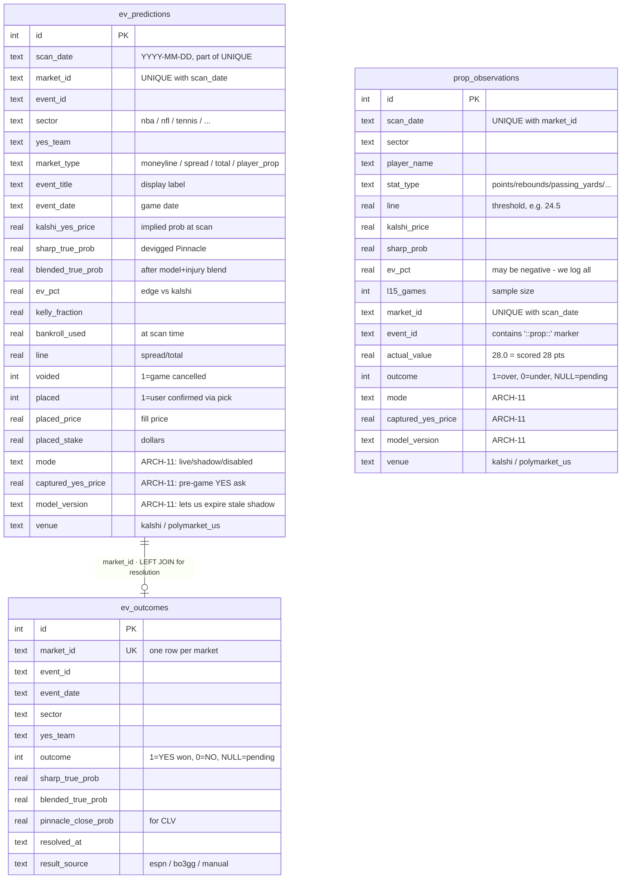

You are an expert in acquiring expected value for specific predictions found on popular prediction markets such as Polymarket and Kalshi. You understand the steps it takes to find events within specific markets that are +EV if you were to bet on the game, knowledgeable of all key aspects of prediction markets such as liquidity, market makers. You are also familiar with the data analysis processes and model training simulations used for finding edges within the certain key sectors.

### Betting Categories & Mode Config

**Single source of truth:** [`data/categories.yaml`](data/categories.yaml). Every bettable category on evmax — its models, mode, resolver, status, and notes — lives in that one file. Don't list sectors in docs or settings; read them from the registry at runtime via `evmax.categories.all_categories()` or from the CLI via `evmax categories list`.

**Current catalog (15 categories):** `nba`, `nfl`, `ncaab`, `ncaaw`, `soccer`, `worldcup`, `tennis`, `baseball`, `wnba`, `nhl`, `lol`, `cs2` (game markets) · `nba_props`, `nfl_props`, `baseball_props` (player props) · and `valorant` was removed because there's no Kalshi product for it (sector handler still exists in `evmax/sectors/registry.py` as a latent sector, same for `ufc` and `f1`, but none of them appear in `SECTOR_SERIES_MAP` so they can't be bet on today).

**`worldcup` (national-team World Cup, added 2026-06-14, shadow):** a SEPARATE sector from club `soccer`, not a reuse — national teams never appear in the club Elo pool and club strength is meaningless for them. It has its own Elo namespace (`elo_state.json['worldcup']`, K=40, `HOME_ADVANTAGE_ELO=0` for neutral venues), its own alias map ([`evmax/sectors/aliases/worldcup.yaml`](evmax/sectors/aliases/worldcup.yaml) — FIFA 3-letter codes + the Pinnacle/ESPN name spellings → one canonical per nation), Kalshi series `KXWCGAME` (3-way: TeamA/TeamB/TIE), and Pinnacle league `2686` (auto-3-way-devigged off the draw price). **Blend MIRRORS club soccer (2026-06-14):** `[elo, form, poisson, xg, sharp]` with the identical `SECTOR_WEIGHT_OVERRIDES` weights — poisson 0.40 · xg 0.25 · elo 0.15 · form 0.10 (sharp via `sharp_weight`) — but every model reads its OWN national-team namespace, never the club `soccer` pool. The two advanced metrics carry over because the stats exist for national teams: **Poisson** off international goals (`poisson_state.json['worldcup']`, SYMMETRIC neutral-venue league avg 1.30/1.30 since there's no home edge; Dixon-Coles + draw mass kept for the 3-way) and **xG** off ESPN `shotsOnTarget`/`totalShots` (`soccer_xg_state.json['worldcup']` — the `SoccerXgAgent` is now sector-namespaced: `soccer` stays at the legacy flat `teams` key, every other sector under `state[sector]['teams']`). National-team Elo is still the genuinely new model — club ratings are meaningless for national sides. **Form** fires only when a team has a fresh (<60d) record — most teams will once group play (and the early-June friendly window) is within range. Seed Elo via [`scripts/seed_national_team_elo.py`](scripts/seed_national_team_elo.py) and the three advanced models via [`scripts/seed_worldcup_advanced.py`](scripts/seed_worldcup_advanced.py) (poisson + xg + form), both walk-forward over ESPN international results (WC + qualifiers + friendlies + continental cups). Resolve-time updates are wired: `coordinator.update_models` feeds elo/form/poisson for `worldcup`, and the xG record-match feed in `model_updater.py` now covers `worldcup` alongside `soccer`. Resolves via ESPN `fifa.world`. Promote with `evmax cleanup shadow promote worldcup` once n≥30 resolved with CLV ≥ 0. **Knockout ADVANCE markets (added 2026-07-05):** Kalshi series `KXWCADVANCE` (`MarketType.advance`, 2-way "Team X advances" incl. ET/pens — distinct from KXWCGAME, which settles on the 90' REGULATION result) is wired into the same sector. Pinnacle has NO live per-match advance market (its "To Reach X" specials cut off at the team's PREVIOUS kickoff and never reopen), so both the sharp anchor and the model prob are derived from the same game's regulation 3-way via `derive_advance_prob` in `evmax/ev/devig.py`: P(adv) = p_win + p_draw·(0.55·r + 0.45·0.5), r = p_win/(p_win+p_opp) — 0.55 calibrated against Kalshi's liquid advance mids (2.0pp vs 3.4pp mean abs error for the pure ratio). Advance records/markets carry a `::advance` event-key suffix and the MatchingEngine filters the candidate pool by that suffix, so advance and regulation records can never cross-match. Advance rows resolve on the ESPN competitor `winner` flag (covers pens); the same resolver change fixed regulation TIE/ML on AET/pens knockout games (STATUS_FINAL_AET/_PEN ⇒ regulation draw — the old score comparison mis-resolved Belgium 3-2 AET Senegal as a Belgium regulation win).

**Three modes** (per category, per invocation):

| Mode       | What happens |
|------------|--------------|
| `live`     | Scanner produces EVGaps, persists rows with `mode='live'`, sizes Kelly against bankroll. Default for every category in the shipped YAML except `nfl_props`. |
| `shadow`   | Scanner produces EVGaps, persists rows with `mode='shadow'` AND `captured_yes_price = pre-game YES ask`, does NOT touch the bankroll. Used by MODEL-9 validation for NFL props. |
| `disabled` | Scanner skips persistence entirely. Gap still appears in the in-memory CLI output for this session, but nothing lands in `ev_predictions` / `prop_observations`. |

**Override precedence (highest wins):** runtime CLI flag > env var `EVMAX_CATEGORY_MODES` > YAML base.

**Per-market-type refinements** (YAML fields on a category, validated at parse time):
- `shadow_market_types: [total]` — downgrades the listed types to shadow when the sector mode is `live` (inert under a shadow base).
- `disabled_market_types: [total]` — drops the listed types before persistence regardless of base mode (live OR shadow). Stronger than the shadow list and must be disjoint from it. Added 2026-06-10 to kill baseball totals (n=102 NO-side unders went −15.2% ROI; stale-line selection, see the baseball notes in the YAML). Runtime/env overrides still win and apply uniformly to all market types.

- Permanent change → edit `data/categories.yaml`
- One-process change → `EVMAX_CATEGORY_MODES='{"nba":"disabled"}' evmax agents scan`
- One-command change → `evmax agents scan --shadow nfl_props --disabled nhl`

**CLI commands added by ARCH-11:**

```bash
evmax categories list [--mode live|shadow|disabled] [--effective]
evmax categories show <key>                # detail view for one category
evmax categories modes                     # effective mode per category
evmax categories validate                  # run validate_registry(), exit non-zero on error

evmax cleanup shadow show [--days N] [--category K]
evmax cleanup shadow metrics [--days N] [--category K]
evmax cleanup shadow promote <category>    # flip shadow → live in YAML

evmax agents scan --shadow X,Y --live Z --disabled W   # runtime overrides
```

**Consistency enforcement:** `evmax/categories.py::validate_registry()` runs eagerly at import time and fails hard if:
- a key in `SECTOR_SERIES_MAP` (in `evmax/clients/kalshi.py`) is missing from `categories.yaml`
- a key in `categories.yaml` is missing from `SECTOR_SERIES_MAP`
- any `models:` entry is not in `evmax.categories.KNOWN_MODELS`
- any `resolver` is not in `evmax.categories.KNOWN_RESOLVERS`
- any `mode` / `status` / `market_types` value is illegal
- a prop category is missing `prop_stat_types` or a game category has them

**Outcome resolution** is specified per-category via the `resolver` field. The shipped values are `espn_scoreboard` (NBA/NFL/NCAAB/NCAAW/soccer/worldcup/baseball/nhl/wnba — worldcup reads ESPN `fifa.world`), `espn_boxscore` (NBA/NFL props), `bo3gg` (LoL/CS2), `kalshi_settlement` (tennis), and `none` (no auto-resolution wired yet). Do not maintain a separate "resolution table" in docs — this field is authoritative.

### Key Pipeline

1. **Fetch live Kalshi markets** for each sector via series tickers (e.g. `KXNBAGAME`, `KXEPLGAME`, `KXATPMATCH`, `KXNCAAWBGAME`)
2. **Fetch Pinnacle sharp lines** via the guest API (`guest.api.arcadia.pinnacle.com/0.1`) for all sectors via `PinnacleGuestClient` in `clients/esports_pinnacle.py`
3. **Fetch ESPN injury data** concurrently for NBA/NFL/NCAAB/NCAAW/Soccer
4. **Fuzzy-match** Kalshi markets to Pinnacle events using canonical keys + rapidfuzz (threshold=88)
5. **Devig Pinnacle lines** using the Power Method (handles 2-way and 3-way markets)
6. **Run statistical models** (Elo + Form + Poisson) in parallel, blend with sharp probability
7. **Apply injury adjustments** — injured players reduce their team's win probability (capped at −10% per team in `apply_adjustments`, −20% at the report level via `MAX_ADJ`). NFL applies sector-aware **position weights** on top of the existing tier system: a QB-OUT counts ~10× a guard-OUT, an LT-OUT ~3× a TE-OUT — see `NFL_POSITION_WEIGHTS` in `injury_agent.py`. Star-tier Mahomes/Allen QB OUT lands at 10.1% (right at the per-team cap), matching the ~7-pt Vegas line shift on those scratches.
8. **Compute EV** = (true_prob × payout) − 1. Flag any gap ≥ 2%
9. **Kelly sizing** = Full Kelly × kelly_fraction × confidence_discount × liquidity_discount, hard capped at 5% of bankroll
10. **Exposure guard** — total Kelly across all bets on the same game capped at 8% of bankroll. *Optional joint sizing:* set `EVMAX_JOINT_KELLY_ENABLED=true` (default off) to replace steps 9–10 with one correlation-aware optimization (`evmax/ev/joint_kelly.py`, wired via `AgentCoordinator._apply_joint_kelly`). Legs sharing a game outcome are sized jointly with a two-factor Gaussian copula (shared *margin* axis for moneyline/spread, shared *total* axis for over/under, private axes otherwise): contradictory legs that hedge get a **variance-scaled gross cap** that expands from 8% toward `joint_kelly_max_gross_pct` (default 15%) as portfolio variance drops below the naive independent sum, while same-direction (redundant) legs stay pinned at 8%. Single-leg events reduce exactly to fractional Kelly.
11. **Log to predictions.db** — game-level bets to `ev_predictions`, player props to `prop_observations`. Each row carries a `mode` column (`live` / `shadow`) plus `captured_yes_price` (pre-game YES ask at scan time) and an optional `model_version`. Disabled categories are dropped before insert. See the Betting Categories section for the mode semantics and CLI overrides.

### Architecture

```
evmax/
├── settings.py              # Pydantic settings from .env; warn_missing_keys()
├── db.py                    # SQLAlchemy async SQLite engine
├── models/                  # Pydantic + ORM: market, odds, ev_bet, simulated_bet, bankroll
├── clients/
│   ├── kalshi.py            # RSA auth, series ticker fetching, WebSocket orderbook, AsyncLimiter(10/s)
│   ├── esports_pinnacle.py  # PinnacleGuestClient — ALL sectors (not just esports despite filename)
│   ├── tennisabstract.py    # Tennis Abstract: Elo leaderboards + matchmx per-match data + winners/errors (SEED-time)
│   └── base.py              # BaseAPIClient
├── sectors/                 # SectorHandler ABC + per-sport implementations
│   ├── registry.py          # Dict mapping sector name → SectorHandler instance
│   ├── nfl.py / nba.py / wnba.py / ncaab.py / ncaaw.py / soccer.py / worldcup.py /
│   │   baseball.py / nhl.py / tennis.py / lol.py / cs2.py  (+ latent: valorant/ufc/f1)
│   └── aliases/             # YAML team name → canonical name mappings per sector
├── matching/
│   └── engine.py            # Canonical key match → fuzzy fallback (rapidfuzz, threshold=88)
├── ev/
│   ├── devig.py             # Power Method via scipy.optimize.brentq (2-way + 3-way)
│   ├── calculator.py        # EV = (true_prob × payout) - 1; YES-side only
│   └── kelly.py             # Kelly fraction with confidence + liquidity discounts, 5% cap
├── models_ml/
│   └── spread_distribution.py  # Normal CDF for spread market cover probabilities
├── agents/
│   ├── base.py              # Agent ABC, AgentBus (pub/sub), AgentRequest/Response
│   ├── coordinator.py       # AgentCoordinator: orchestrates full cycle, exposure guard
│   ├── odds/                # KalshiOddsAgent, SharpOddsAgent, EVGapAgent
│   ├── models/              # EloModelAgent, FormModelAgent, PoissonModelAgent, EnsembleModelAgent, TennisModelAgent
│   ├── intelligence/        # InjuryReportAgent (ESPN public API)
│   └── cleanup/             # db.py, logger.py, resolver.py, metrics.py, maintenance.py
├── simulation/
│   └── montecarlo.py        # Monte Carlo bankroll simulation
├── categories.py            # Category registry loader + validate_registry() (reads data/categories.yaml)
├── modes.py                 # Effective mode resolution: CLI flag > EVMAX_CATEGORY_MODES env > YAML
├── portfolios.py            # Multi-portfolio simulated bankrolls (tables live in predictions.db)
├── players/                 # Player-code mappings for prop resolution (nba/nfl/baseball)
├── web/                     # Web dashboard app (launched via evmax dashboard)
├── archiver.py              # Archive all Kalshi/Pinnacle data to archive.db
├── notifications.py         # Slack + Discord webhook alerts
└── cli/
    ├── app.py               # Typer root app
    └── commands/
        ├── agents.py        # evmax agents scan/verify/pick/seed/ratings/update
        ├── cleanup.py       # evmax cleanup show/resolve/metrics/adjust/value-audit/watch-closes/watch-listings/listings-eval
        ├── shadow.py        # evmax cleanup shadow show/metrics/clv/promote
        ├── categories.py    # evmax categories list/show/modes/validate
        ├── archive.py       # evmax archive stats/resolve/backtest/export
        ├── backtest.py      # evmax backtest
        ├── sim.py           # evmax sim list/resolve/montecarlo
        ├── report.py        # evmax report (P&L from simulation DB)
        ├── project.py       # evmax project slate (standalone point projections)
        ├── portfolio.py     # evmax portfolio (multi-portfolio management/scanning)
        ├── dashboard.py     # evmax dashboard (web UI)
        └── update.py        # evmax update scores (auto ESPN model updates)
```

### Modeling

**Statistical Models** (blended by `EnsembleModelAgent`). For which models contribute to which category, see the `models:` field per entry in `data/categories.yaml`. This table is model-centric — it lists the ensemble weight, confidence gate, and state file for each agent regardless of which categories consume it.

| Model | Weight | Confidence Gate | State File |
|-------|--------|----------------|------------|
| Elo | 0.35 | 0.45 | `data/models/elo_state.json` (per-sector `last_updated` stamp, written by `update()`; the agent returns `None` when the sector's state is > STALE_DAYS=60 older than the game's event_date — same protection as form, added 2026-06-10 after frozen March baseball ratings fired at 0.25 weight into June blends. Legacy states without the stamp are never gated.) |
| Form | 0.25 | 0.45 | `data/models/form_state.json` (skipped entirely when the most recent record for either team is > STALE_DAYS=60 old relative to the game's event_date — protects against cross-season contamination; opponent-quality weighting was backtested net-negative and reverted) |
| Poisson | 0.40 (soccer + worldcup) | 0.45 | `data/models/poisson_state.json` (FOOTBALL-ONLY — `SUPPORTED_SECTORS = {"soccer", "worldcup"}` in `poisson_agent.py`. `worldcup` added 2026-06-14 with its OWN namespace (`poisson_state['worldcup']`) and symmetric neutral-venue league avg 1.30/1.30; `SOCCER_LIKE_SECTORS` gates Dixon-Coles + draw retention for both. `predict_pair` returns `None` for every other sector, so poisson never enters the blend or `model_sources`. This is enforced at the agent, not via ensemble weight: the per-sector override only re-weights *listed* models, so an unlisted poisson would otherwise fall back to its 0.30 class weight — that's how it was silently contributing 0.30 to NCAAB and ~0.30 to baseball before the cleanup. The `poisson: 0.0` entries left in the NBA/WNBA/NFL overrides are now redundant no-ops.) |
| NBA Efficiency | 0.40 | 0.45 | `data/models/efficiency_state.json` (NBA only; ORTG/DRTG/Pace from `nba_api.LeagueDashTeamStats`) |
| NBA Possession Sim | 0.35 | 0.45 | Reuses NBA efficiency state; 10k Monte Carlo possession sims per matchup |
| NBA Shot Quality | 0.20 | 0.45 | `data/models/shot_quality_state.json` (NBA only; zone FGA + FG% from `nba_api`) |
| NBA Matchup | 0.20 | 0.45 | `data/models/matchup_state.json` (NBA only; paint + transition + TOV battle) |
| **WNBA Efficiency** | 0.30 | 0.45 | `data/models/wnba_efficiency_state.json` (seeded by `scripts/seed_wnba_efficiency.py` from 2025 ESPN box scores via Dean Oliver formulas; WNBA-tuned HOME_EDGE_PTS=2.6, SCORE_STDEV=12.5, MIN_GAMES=12) |
| **WNBA Possession Sim** | 0.25 | 0.45 | Reuses `wnba_efficiency_state.json`; 10k Monte Carlo possession sims per matchup. Pace clipped to [65, 100] (WNBA has 40-min games + lower pace than NBA). `cover_probability` / `total_probability` ready for spread + total live promotion. |
| Tennis Surface Elo | 0.35 | 0.45 | `data/models/tennis_surface_state.json` (surface resolved from Kalshi `event.product_metadata.competition` via MODEL-1; MODEL-5 trimmed weight from 0.45. **Re-sourced 2026-06-27:** Sackmann's `tennis_atp`/`tennis_wta` GitHub repos went offline, so this is now seeded from **Tennis Abstract's** weekly Elo leaderboards (`evmax/clients/tennisabstract.py` → `TennisModelAgent.seed_precomputed_surface_elo`) — pre-computed overall + hElo/cElo/gElo on the 400-pt scale, mapped to overall/hard/clay/grass + indoor←hard. Seed via `scripts/seed_tennis_abstract_elo.py` (idempotent; aborts without writing on empty fetch; also FULL-REPLACES the ATP/WTA ranking priors per tour — merge semantics let retired players linger at stale ranks until 2026-07-01), validated by `scripts/backtest_tennis_abstract_elo.py` (Wayback walk-forward, n=2865 ATP: Brier 0.2239/acc 64.0% vs Pinnacle 0.2094, beats the old tennis-data.co.uk source by −0.0137 Brier / +10pp). Scheduled task `weekly-tennis-surface-elo-refresh` runs it Tuesdays. The synthetic per-player game count (default 12) keeps `predict_pair` confidence mid-range (~0.61) since the source has no per-surface sample sizes.) |
| Tennis Serve/Return | 0.15 | 0.45 | `data/models/tennis_serve_return_state.json` (logistic on SPW differential, bo3 k=14 / bo5 k=18; weight reduced from 0.40 — destructive at higher weight) |
| Tennis Advanced Stats | 0.25 | 0.45 | `data/models/tennis_advanced_state.json` (logistic on BP conv, RPW, UE rate, W/UE ratio; full 4-feature model when MCP data available, RPW-only reduced model otherwise; fitted on 2023-2024 Sackmann + MCP, validated on 2025) |
| Tennis H2H | 0.10 | 0.45 | `data/models/tennis_h2h_state.json` (Laplace-smoothed nudge, ≥3 meetings, ±18pp cap) |
| Tennis Ranking Trend | 0.10 | 0.45 | `data/models/tennis_ranking_trend_state.json` (reworked 2026-06-10: logit = 0.40·Δlog-rank **absolute** + capped(0.15·12-week **log-space** momentum, ±0.40); anchored at `market.event_date` with a 6-week staleness guard — eval Brier 0.2530 → 0.2249, acc 49.8% → 64.2% on 2025+2026 walk-forward, params swept on 2024 only (`scripts/experiment_ranking_trend.py`). The old raw-spots 0.5-centered nudge was coin-flip noise. **Re-sourced to pure Tennis Abstract 2026-06-27:** now seeded from **matchmx**'s per-match `winner_rank` / `loser_rank` columns by `scripts/seed_tennis_models.py::aggregate_ranking_history` — one dated rank snapshot per match date, a **full-replace** of the store (`seed_history` no longer merges, so players who age out of TA coverage don't linger stale). matchmx covers ~2.5 trailing seasons current to within days, so for active players the series is denser than the old weekly Mondays and keeps the 6-week staleness guard fed (latest snapshot tracks each player's last match). A typical seed is ~900 players, ~720 with the ≥4 snapshots the trend window needs. The old Sackmann `reseed_tennis_rankings.py` + ESPN `refresh_tennis_rankings_espn.py` two-source pipeline and its `weekly-tennis-rankings-refresh` task were **deleted** — ranking_trend now rides the `weekly-tennis-surface-elo-refresh` Tuesday task alongside the other matchmx models. matchmx only carries players who played, so the deep inactive tail the Sackmann CSVs listed is gone by design — those players can't fire a meaningful trend anyway. The 2026-06-10 eval numbers above predate the source swap (signal is the same quantity — official rank over time — just match-sampled).) |
| MLB Pitcher | 0.50 | 0.45 | `data/models/pitcher_state.json` (FIP-blended ERA — 60% FIP / 40% ERA when seeded — + Pythagenpat exp=1.83 + adaptive HOME_BONUS; live probable starters from the **official MLB Stats API** (`evmax/clients/mlb_statsapi.py`, `statsapi.mlb.com`), 30-min cache, keyed by **stable team id** so multi-word nicknames (Red Sox/White Sox/Blue Jays) can't drop out of the blend; ESPN scoreboard kept as fallback. Baseball ML now **skips when the pitcher model is absent** rather than firing a generic elo+form blend (those went −23% live ROI). baseline weight bumped from 0.30 → 0.50 on 2026-05-01 alongside per-sector override that zeroes Poisson) |
| **NFL Efficiency** | 0.25 | 0.45 | `data/models/nfl_efficiency_state.json` (NFL only; opponent-adjusted off/def EPA per play from `nflreadpy` PBP, garbage-time WP filter [0.10, 0.90], season-decay 0.45 over last 6 seasons; HOME_EDGE_PTS=2.0, SCORE_STDEV=13.5, PLAYS_PER_TEAM_GAME=64, MIN_GAMES=6. Replaces Poisson on NFL — see MODEL-13. Re-seed weekly during the season via `scripts/seed_nfl_efficiency.py`. Weight tuned via Phase 1+2 backtest sweep — see `scripts/backtest_nfl_efficiency.py`. **Freshness guard (2026-06-11):** `nfl_state_is_stale_for_today` returns None when `max(seasons_used)` is behind the active NFL season during the Sep-Feb window — same WNBA-style guard against a frozen prior-season seed firing across the offseason. NFL season wraps the year (active season = year if month≥7 else year−1), so a Jan/Feb game on a current-year seed stays fresh.) |
| **NFL QB Elo** | 0.25 | 0.45 | `data/models/nfl_qb_elo_state.json` (NFL only; team_base + per-QB delta layer so starter swaps shift effective Elo without retraining team strength. K=25, HOME_ADVANTAGE_ELO=48, QB_UPDATE_SHARE=0.60, QB_DELTA_CLAMP=±200. Walk-forward seeded from nflreadpy PBP (max-attempts passer per game = starter); `current_starters` reflects the latest starter seen per team and gets refreshed by re-running `scripts/seed_nfl_qb_elo.py` weekly. Best individual-model Brier across 3-season backtest (0.2259, ahead of generic Elo at 0.2279). Replaces nothing — supplements generic Elo so the ensemble can express "team minus QB" vs "team plus current starter". Shares the `nfl_state_is_stale_for_today` freshness guard. **MOV scaling — backtest-REJECTED (2026-06-11):** `apply_qb_elo_update` now exposes an opt-in `use_mov` param (FTE-style blowout multiplier, default OFF) but enabling it in the walk-forward only moved combined-3-season blend Brier 0.2210→0.2208 while DEGRADING the 2526 holdout (P2 v1 ΔAcc −0.35pp→−1.05pp, gate marker ✓→~). Not promoted to seed/live; kept as a documented default-off lever. Do not re-attempt without a holdout that clears both gates.) |
| NBA Props Cache | — | — | `data/nba_props_cache.json` (daily L15 per-player; per-36 normalization + opponent adj) |
| NFL Props Cache (QB only v1) | — | — | reuses `data/backtest/nfl_props/*.parquet`; live lookup via `evmax/clients/nfl_props_cache.py` (point-in-time history + schedule opponent adj). Wired to coordinator NFL branch for shadow scans (MODEL-9). Stage 5 live Kelly gated on 2026 shadow validation |
| Sharp (Pinnacle) | 0.85 (CLI/config default) | always | auto-tuned in `data/model_config.json` |

**Per-sector ensemble overrides** (`ensemble_agent.py::SECTOR_WEIGHT_OVERRIDES`):
- **NBA:** efficiency 0.30 · possession_sim 0.30 · elo 0.10 · form 0.10 · shot_quality 0.10 · matchup 0.10 · poisson 0.0
- **WNBA:** wnba_efficiency 0.40 · wnba_possession_sim 0.45 · elo 0.15 · form 0.0 · poisson 0.0 (re-tuned 2026-05-14 via `scripts/sweep_wnba_weights.py` over 321 walk-forward 2025 games — drops blend Brier 0.2061 → 0.2019. Form was worst standalone (Brier 0.2303) and every top-20 combo zeroed it; generic Elo also weaker than the WNBA-specific stack.)
- **Soccer:** poisson 0.40 · xg 0.25 · elo 0.15 · form 0.10
- **World Cup (national teams):** poisson 0.40 · xg 0.25 · elo 0.15 · form 0.10 — IDENTICAL to soccer's weights, but on the `worldcup` namespaces (Elo/poisson/xg/form `_state['worldcup']`), never the club `soccer` pool. xG is sector-namespaced inside `soccer_xg_state.json`; poisson uses symmetric neutral-venue averages (no home edge).
- **Tennis:** tennis_surface 0.30 · tennis_serve_return 0.10 · tennis_form 0.35 · tennis_advanced 0.15 · tennis_h2h 0.05 · tennis_ranking_trend 0.05 (**retuned 2026-06-27**: serve_return cut 0.25→0.10, its 0.15 moved to form 0.20→0.35. Point-in-time ATP walk-forward weight sweep (`scripts/tennis_weight_signal.py`) + leave-one-out (`scripts/analyze_tennis_full_blend.py`) found serve_return net-negative at 0.25 and form the workhorse; train Brier 0.207937→0.207750, holdout 0.210039→0.209732. serve_return kept at 0.10 not 0 — a 0-weight model drops out of `model_sources` and would fail the full-blend gate below. Surface/advanced left as-is: the harness understates them (crude matchmx-replay Elo + RPW-reduced advanced), so only the robust serve/form move was made. **Do NOT fine-tune these weights on close-Brier** — a faithful follow-up harness (`scripts/tennis_weight_optimize.py`, real Tennis Abstract Elo seeded point-in-time from Wayback) shows the blend does NOT beat the Pinnacle close out-of-sample (holdout blend 0.21151 vs sharp 0.21011; bootstrap 95% CI of the diff [−0.23, +2.99]/1000), the train/holdout sign flips, and a coordinate-descent optimizer goes degenerate (pumps h2h to 0.50 on 84 firing matches). Weight differences are below the noise floor on every offline close-anchored signal; the models' edge (if any) is CLV vs the stale live line, so use CLV (`cleanup shadow clv`) as a guardrail/tripwire, not a fine-tuning objective. The matchmx-replay harness's apparent blend edge was an artifact of its crude surface proxy.)
- **Baseball:** pitcher 0.50 · elo 0.25 · form 0.25 (poisson is genuinely excluded now — `baseball` was removed from `SUPPORTED_SECTORS` in `poisson_agent.py` on 2026-06-01. Until then the "not listed = never instantiated" assumption was wrong: poisson ran and contributed at its 0.30 class-weight fallback to every baseball blend. See the Poisson row above.)
- **NFL:** nfl_efficiency 0.25 · nfl_qb_elo 0.25 · elo 0.20 · form 0.30 · poisson 0.0 (Phase 2 weights validated 2026-05-01: best combined-3-season blend by ΔBrier +0.0030 / ΔAcc +1.01pp vs the old elo+form+poisson blend, with positive 2526-only delta on both metrics. Generic elo down-weighted to 0.20 because nfl_qb_elo overlaps it. **Form-weight sweep — backtest-REJECTED (2026-06-11):** redistributing form (0.30) down to 0.20/0.10/0.0 toward nfl_efficiency/nfl_qb_elo was swept against `scripts/backtest_nfl_efficiency.py --seasons 2324,2425,2526`. Every variant LOST to form 0.30 on combined Brier (0.2210 stays best) AND on the 2526 holdout (all negative ΔBrier vs OLD; form 0.0 collapsed −0.0086 / −2.80pp on 2526). Form 0.30 kept — counterintuitively it's the strongest NFL weight even though it's generically weak elsewhere. Do not re-attempt without new evidence.)

**NBA and WNBA are parallel stacks with zero shared files.** NBA's `efficiency_agent.py` uses `nba_api` + `efficiency_state.json`; WNBA's `wnba_efficiency_agent.py` uses ESPN box scores + `wnba_efficiency_state.json`. Same for possession sim. Change one without risk to the other. Do not merge them "for DRY" — the constants diverge (HOME_EDGE_PTS 3.2 vs 2.6, SCORE_STDEV 12.0 vs 12.5, pace clip [80,120] vs [65,100]), and the data sources are different.

Tennis serve/return, H2H, advanced, and form agents were historically seeded from Jeff Sackmann's `tennis_atp` / `tennis_wta` CSVs plus the Match Charting Project for 2025+ SPW augmentation via `scripts/seed_tennis_models.py`. **As of 2026-06-27 those two GitHub repos are offline** (404 from the GitHub API; only `tennis_MatchChartingProject` survives). Re-sourcing status — all live again from **Tennis Abstract**:
- **Surface Elo** — pre-computed Elo leaderboards (see the Tennis Surface Elo row above); `scripts/seed_tennis_abstract_elo.py`.
- **Serve/return, advanced, form, h2h** — re-sourced via **`matchmx`** (`evmax/clients/tennisabstract.py::fetch_matchmx`), the per-match serve/return/break matrix behind `leaders.cgi`'s `leadersource*.js` files. It carries the same per-match columns the dead Sackmann CSVs did (svpt/1stWon/2ndWon/bpSaved/bpFaced + the opponent's), full tour (~900 ATP / ~390 WTA players, 2024→present) across the top-50/51-100/challenger segments. `seed_tennis_models.py` now pulls from it — `collect_matches` reads matchmx instead of the dead CSVs, and the aggregate functions are unchanged. Advanced's winners/UE feature (the one thing matchmx lacks) comes from the winners/errors leaderboards (`fetch_winners_errors`, `winners_errors_leaders_{men,women}_last52.html`, sparse → unlisted players use the RPW-reduced model).
- **Ranking trend** — re-sourced to **matchmx** (`aggregate_ranking_history` in `seed_tennis_models.py`): each player's official rank at match time (`winner_rank`/`loser_rank`) becomes a dated snapshot, full-replacing the store. The Sackmann reseed + ESPN fallback scripts and their scheduled task were deleted; ranking_trend now seeds with the other matchmx models. (matchmx has no weekly snapshot series, but match-sampled rank points are dense enough for the 12-week momentum window.)

- Models below the confidence gate are excluded from the blend entirely
- `model_sources` in each EVGap only lists models that actually contributed
- `sharp_weight` auto-tunes weekly based on Brier score comparison (bounds: 0.40–0.95)
- All game-level models seeded from ESPN historical game data via `scripts/seed_espn.py`
- When adding a new model agent, also add its canonical name to `evmax/categories.py::KNOWN_MODELS` AND update the relevant per-category `models:` list in `data/categories.yaml` — the pre-commit `doc-sync` hook nudges both, and `validate_registry()` fails loudly at import time if either is missed.

### Key Implementation Details

- **Kalshi rate limiting**: `AsyncLimiter(10, 1.0)` from `aiolimiter` in `kalshi.py` — token bucket, 10 req/s
- **Kalshi ticker dates**: `_parse_ticker_date` anchors at **noon UTC** (not midnight) so downstream `.astimezone()` can't roll the game date back a day in negative-offset US time zones
- **Pinnacle parallelism**: all `(sport_key × market_type)` combinations fetched simultaneously
- **Bankroll persistence**: `bankroll_used` column in `ev_predictions` — verify/pick reuse scan-time bankroll automatically. Shadow rows do NOT touch bankroll (Kelly sizing is skipped for `mode='shadow'`).
- **Props**: player prop gaps (event_id contains `::prop::`) land in `prop_observations`, not `ev_predictions`. They carry the same `mode` / `captured_yes_price` / `model_version` columns as game bets. The prop filter `::prop::` in `event_id` is how `log_prop_observations` picks them out.
- **Exposure guard**: total Kelly per game ≤ 8% bankroll; excess bets scaled/dropped. Only applies to `mode='live'` rows.
- **Full-blend gate (tennis)**: `REQUIRED_BLEND_MODELS` in `ev_gap_agent.py` — a tennis gap is only a live play when `model_sources` contains all four primary models (`tennis_surface`, `tennis_serve_return`, `tennis_form`, `tennis_advanced`; h2h/ranking_trend optional — they structurally can't fire on most matches). Partial-blend gaps get `full_blend=False`: hidden from the play table, kelly zeroed, excluded from the exposure budget, and demoted to `mode='shadow'` by `log_gaps` (still logged for calibration). Rationale: walk-forward (n=2576, 2025+2026) shows the full blend beats sharp +2.6 Brier/1000 while sparse blends are a wash — sharp-passthrough "edges" are thin Kalshi-vs-Pinnacle arb, not model edge. **Gotcha:** `_blend` skips any model with `eff_w <= 0` (`ensemble_agent.py` ~L482), so a model dropped to weight 0 in a `SECTOR_WEIGHT_OVERRIDES` entry vanishes from `model_sources` — for a sector with a `REQUIRED_BLEND_MODELS` entry (tennis), that silently demotes EVERY play to shadow. Never zero a required blend model's weight; floor it (e.g. tennis serve_return at 0.10).
- **Fuzzy match underscore fix**: `_` replaced with space before rapidfuzz scoring
- **YES team alignment**: Kalshi has separate YES markets per team — swap `true_prob_a ↔ true_prob_b` when YES = away
- **Draw market**: Soccer TIE markets use `true_prob_draw`, not `true_prob_a`
- **NO-side deduplication**: only YES side evaluated to prevent double-counting
- **Enum values are lowercase**: `MarketType.spread`, `MarketSource.kalshi`, `SharpBook.pinnacle`

### Key Goals

Find +EV plays (cognizant of liquidity) when they appear on Kalshi, and place Kelly-fractioned bets on these plays for long-run profitability. Track performance via `predictions.db`, resolve outcomes automatically, and auto-tune model weights based on Brier score calibration.

### Testing Policy

**Tests are required for new logic.** When you add or modify any module under `evmax/` that
contains real logic (model agents, EV math, devigging, matching, resolution, Kelly sizing,
sector handlers, clients), you must write or extend the corresponding test in `tests/`.

- New module → new test file (or new test class in the closest existing file)
- New function or branch → at least one happy-path + one edge-case test
- Bug fix → a regression test that fails before the fix and passes after
- A change that touches `evmax/agents/models/`, `evmax/ev/`, `evmax/matching/`,
  `evmax/agents/odds/`, or `evmax/agents/cleanup/resolver.py` is **not done**
  until `tests/` has a matching change

The pre-commit `test-sync` hook will remind you if you stage source changes in these areas
without staging a test change. The reminder is advisory — it never blocks a commit — but
treat it as a hard rule: skipping it accumulates the test-coverage debt that already exists
for `tennis_model_agent.py`, `pitcher_agent.py`, and `clients/esports_pinnacle.py`.

Run `pytest tests/ -q` before declaring any task complete.

### CLI Output Requirements

Every table produced by any CLI command (scan, verify, pick, show, etc.) MUST include both of these columns:

- **Event** — the full matchup title (e.g. "Dallas Mavericks vs LA Clippers"). Never truncate to fewer than 24 characters. Use `no_wrap=False` so long names wrap within the cell rather than being cut off.
- **Outcome** — the specific bet being made (e.g. "Clippers ML", "Hawks -4.5", "O/U 224.5"). Always show market type and line where applicable.

These two columns must appear before any odds/probability/EV columns. No table may omit either field — they are the primary identifiers that let the user know exactly what they are looking at before reading any numbers.

### Daily Workflow

```bash
# Morning — find plays (bankroll stored in DB automatically). Treat this as a
# WATCHLIST, not a bet list: the night-before edge is usually a stale Kalshi
# line that reverts toward the sharp close by tip-off (only the <1h-pre-tip
# entry window carries positive CLV — see the Placed-bet CLV notes).
evmax agents scan --bankroll 500 --kelly 0.5

# Before betting — verify live prices via WebSocket (read-only check)
evmax agents verify --date YYYY-MM-DD

# At ~T-60 to tip — place against the LIVE price. `pick` re-fetches live Kalshi
# asks by default and gates/sizes at the current ask, so stale edges that have
# already reverted drop out automatically (--no-live keeps the old scan-price
# behaviour for offline use). The Scan/Live/Δ columns show edge erosion.
evmax agents pick --date YYYY-MM-DD --bankroll 500 --kelly 0.5

# Background service — captures the near-tip Kalshi + Pinnacle close so placed-bet
# CLV has a genuine post-entry price to anchor against (runs unattended via
# launchd `com.evmax.watch-closes`, every 5 min — the user crontab was removed 2026-06-28).
# Snapshots cover BOTH live and shadow bets (widened 2026-07-05) so the shadow CLV
# promotion gate gets a real near-tip close, not just the last hourly listings sweep.
evmax cleanup watch-closes            # always-up; or `--once` per sweep

# Background service — captures the LISTING→scan window (default: ALL game
# sectors, spread+total ladders, hourly): Kalshi price snapshots + order-book
# depth (archived_orderbook_depth) + as-of Pinnacle anchor. Kalshi lists WNBA
# spread ladders ~2 days pre-tip as MM placeholder quotes; the whole harvestable
# move happens before the daily scan, so this stream is what the depth-aware
# entry rule / lay-side CLV gate (`cleanup shadow clv --side lay`) evaluates.
# Offseason sectors cost one cheap Kalshi fetch and archive nothing; the
# Pinnacle anchor is only fetched for sectors with open markets in the window.
# Deliberately NO injuries/models: the devigged-Pinnacle anchor already impounds
# news — this measures venue timing (Kalshi-vs-sharp convergence + fillability),
# not forecasting. Writes archive.db only. Runs unattended via launchd
# `com.evmax.watch-listings` (hourly).
evmax cleanup watch-listings          # always-up; or `--once` per sweep
evmax cleanup watch-listings -s wnba -m spread --once   # narrow one-off sweep

# Offline promotion lens for laddered markets — replay the watch-listings capture
# through the FIRST-ANCHORED-SWEEP entry rule (first hourly snapshot with a
# concurrent Pinnacle anchor able to price the ticker's line; Kalshi lists ~6-24h
# BEFORE Pinnacle posts, so raw listing time is unanchored noise), gate on
# EV>=2pp at the crossable price + resting depth >=$50, score Kalshi CLV to the
# last pre-tip snapshot per market/side (lay/take, over/under). Read-only.
evmax cleanup listings-eval -s wnba [--detail] [--ev-min 2] [--depth-min 50] [--since D]

# Next morning — resolve yesterday's outcomes
# (resolve also feeds the date's completed ESPN scores into elo/form/poisson/xg
#  state for the 7 game sectors — pass --no-update-models to skip. This is what
#  keeps model state fresh; `evmax update scores` remains for manual backfills.)
evmax cleanup resolve --date YYYY-MM-DD
evmax archive resolve --date YYYY-MM-DD

# Check bet log
evmax cleanup show --days 7

# Weekly — calibrate models
evmax cleanup metrics --weeks 4
evmax cleanup adjust

# Weekly — model-blend VALUE audit (Brier vs entry-sharp AND vs Pinnacle close, CLV,
# calibration) with significance + an actionability verdict per sector. Distinguishes a
# real model gap from noise: a sector is only ⚑actionable when the blend is SIGNIFICANTLY
# worse than the sharp line (z≤−1.64) or has a consistent calibration bias — both fixable
# in the MODELS (reweight / recalibrate), never by gating plays. Beating the *close* is
# rare/not expected; CLV is context only (a fine-Brier/negative-CLV sector is an entry-
# timing issue, not a model fix). Reports land in docs/value-audits/. See value_audit.py.
evmax cleanup value-audit --weeks 12          # add --json for agents, --sector S to focus

# Shadow-mode validation (MODEL-9 pattern)
evmax categories list --mode shadow               # see what's in shadow today
evmax cleanup shadow show --days 7                # recent shadow predictions
evmax cleanup shadow metrics --days 30            # Brier + ROI per category (excludes superseded-code rows by default; `Excl` column + footer report the drop; --include-contaminated to score them)
evmax cleanup shadow promote nfl_props            # flip shadow → live once validated (refuses if < 30 clean current-code resolved rows; --force overrides)
evmax cleanup shadow clv wnba -m spread --side lay  # Kalshi entry→close CLV, the promotion lens for laddered markets. --side lay/take splits by bet direction (line sign) — the 2026-07 audit found the sides are different products at scan entry (laying ~breakeven, taking bleeds −2.2pp buying a NO-side run-up), so judge spread promotion per side, never pooled. --since drops a stale period.
```

### WNBA-specific maintenance (2026 season)

```bash
# Once per offseason — regress 2025-end Elo toward 1500 and apply roster-move deltas
# Edit data/models/wnba_2026_offseason.yaml if moves change; rerun before opening day
python scripts/wnba_offseason_regress.py --dry-run      # preview
python scripts/wnba_offseason_regress.py                # apply + auto-backup

# Weekly during the season — refresh ORTG/DRTG/pace/eFG/TOV/OREB/FTr from ESPN box scores
python scripts/seed_wnba_efficiency.py --year 2026      # regular-season refresh
python scripts/seed_wnba_efficiency.py --dry-run        # preview without writing

# One-time backtest check of the live WNBA ensemble against the 2025 season
evmax backtest run --sectors wnba --seasons 2425        # walk-forward; ~30s

# Post-launch — validate shadow mode before flipping to live (see MODEL-11)
evmax cleanup shadow metrics --days 30 --category wnba
evmax cleanup shadow promote wnba                       # once validation passes
```

**Things to keep in mind for WNBA:**
- **Seeds are manual.** `scripts/seed_wnba_efficiency.py` re-walks ESPN; the agent's `update()` is a no-op because per-game (FGA, FTA, TO, OREB) can't be reconstructed from just a score pair. Re-run weekly or stats stay frozen at last seed date.
- **Offseason regression is manual.** `scripts/wnba_offseason_regress.py` must be run once before each WNBA season opener and after any mid-season mega-trade. Backs up the old state automatically.
- **The offseason script only touches `elo_state.json`, NOT `wnba_efficiency_state.json`.** That gap caused +24pp chalk bias over the 2026 opening month (e.g. Aces predicted 74% ML, went 0/3) because efficiency + possession_sim were reading raw 2025 end-of-season ratings to predict 2026 games. **Fix:** re-seed efficiency from the current year via `python scripts/seed_wnba_efficiency.py --year <current>` at season open. The agent also enforces a `state_is_stale_for_today()` guard that returns None whenever `source_season` is behind the current calendar year during May-Oct — so this failure mode can't silently recur next offseason.
- **Empirical-Bayes shrinkage is applied at predict time** (`shrink_team_stats` in `wnba_efficiency_agent.py`) so the model uses partial-season data without overreacting to it. Formula: `shrunk = (gp · raw + k · league_avg) / (gp + k)` with k=8 (gp=8 → 50/50; gp=24 → 75/25 raw). `MIN_GAMES` lowered to 4 — shrinkage handles the noise. `smooth_confidence(min_gp)` ramps confidence 0.40 → 0.80 across gp ∈ [0, 40] instead of stepping. Both `wnba_efficiency` and `wnba_possession_sim` share these helpers so the regularization stays consistent across the WNBA model stack.
- **Exhibition games contaminate seeds.** ESPN's WNBA scoreboard also carries the All-Star Game and international exhibitions. `REAL_WNBA_TEAMS` allow-list in the seed script filters them — any new WNBA data pipeline needs the same filter or league averages will skew.
- **Form staleness protects opening day.** `FormModelAgent` returns `None` when records are >60 days old relative to the game date. On May 8 2026 the only WNBA records are from October 2025 — form skips automatically and Elo + Efficiency drive the blend. No manual toggle needed.
- **WNBA stays in `shadow` mode** until MODEL-11 validation clears. Kelly stakes don't hit the bankroll even though predictions are logged. Promote via `evmax cleanup shadow promote wnba`.
  - **Validation gate (7-day window, ML first):** the standard MODEL-9 30-day window is overkill for WNBA — the backtest already validated the model (Brier 0.2058 on 321 walk-forward games; see `evmax backtest run --sectors wnba --seasons 2425`). Shadow exists to validate the *live wiring* (Kalshi `KXWNBAGAME` matching, Pinnacle devig, injury agent, mode/captured_yes_price columns), not to re-prove model edge. After ~7 days of live shadow data, promote moneyline if all three clear: (a) ≥75 logged bets in `ev_predictions` with `mode='shadow' AND sector='wnba'`, (b) CLV ≥ 0 across resolved markets (compare `blended_true_prob` to `pinnacle_close_prob` on `ev_outcomes`), (c) no matching/devig errors in `evmax cleanup shadow show --days 7`. Spread + total stay shadow another 1–2 weeks because Kalshi totals volume is thinner and `wnba_possession_sim`'s totals output is newer to live.

### Scan Pipeline

What happens on a single `evmax agents scan` invocation, from CLI input to persisted rows. The numbered Key Pipeline list above is the authoritative reference; this diagram is the visual companion.

```mermaid
flowchart TD
    CLI[evmax agents scan<br/>--sectors, --bankroll, --kelly,<br/>--shadow/--live/--disabled] --> COORD[AgentCoordinator.run_cycle]

    subgraph FETCH[1. Data fetch · parallel fan-out]
        K[KalshiOddsAgent<br/>SECTOR_SERIES_MAP → /markets<br/>+ /events for tennis]
        P[PinnacleGuestClient<br/>devig-ready sharp lines<br/>per sector × market_type]
        I[InjuryReportAgent<br/>ESPN public API<br/>NBA/NFL/NCAAB/NCAAW/soccer]
        S[StandingsAgent<br/>ESPN standings]
    end
    COORD --> FETCH

    FETCH --> MATCH[MatchingEngine<br/>canonical key → rapidfuzz fallback<br/>threshold = 88]
    MATCH --> DEVIG[ev/devig.py Power Method<br/>2-way + 3-way]

    subgraph MODELS[2. Statistical models · parallel fan-out]
        ELO[EloModelAgent]
        FORM[FormModelAgent]
        POIS[PoissonModelAgent]
        PITCH[PitcherModelAgent · MLB only]
        TEN[Tennis agents ×4 · tennis only]
    end
    DEVIG --> MODELS
    MODELS --> ENS[EnsembleModelAgent<br/>confidence-weighted blend<br/>+ sharp_weight from model_config.json]

    ENS --> INJ[Injury adjustment<br/>−10% per team cap]
    INJ --> EVGAP[EVGapAgent<br/>compute EV · YES-side only · swap if needed]
    EVGAP --> FILTER{ev_pct ≥ threshold<br/>AND blended_prob ≥ min_prob?}
    FILTER -->|no| DROP1[Drop]
    FILTER -->|yes| KELLY[Kelly sizing<br/>× confidence × liquidity<br/>5% cap per bet]
    KELLY --> EXP[Exposure guard<br/>≤ 8% bankroll per game]
    EXP --> DISPLAY[Print EV table to terminal]

    DISPLAY --> MODE{evmax.modes.get_mode<br/>category?}
    MODE -->|live| WLIVE[log_gaps / log_prop_observations<br/>mode='live' · captured_yes_price set]
    MODE -->|shadow| WSHADOW[log_gaps / log_prop_observations<br/>mode='shadow' · captured_yes_price set<br/>Kelly × 0 = no bankroll touched]
    MODE -->|disabled| DROP2[Drop before insert]
    WLIVE --> DB[(predictions.db<br/>ev_predictions / prop_observations)]
    WSHADOW --> DB

    DB --> MAINT[run_maintenance<br/>rule violations · duplicates · stale markets]

    style DB fill:#1a3c5a,color:#fff,stroke:#4a90d9
    style CLI fill:#2d4a2d,color:#fff,stroke:#4caf50
    style FILTER fill:#4a3a1a,color:#fff,stroke:#c48b2f
    style MODE fill:#4a3a1a,color:#fff,stroke:#c48b2f
    style DROP1 fill:#4a1a1a,color:#fff,stroke:#d94a4a
    style DROP2 fill:#4a1a1a,color:#fff,stroke:#d94a4a
```



- **Fan-out stages (FETCH, MODELS)** run in `asyncio.gather` — the coordinator launches every agent in parallel and waits for all results before moving forward.
- **Mode resolution** at the last persistence step is the ARCH-11 addition: `evmax.modes.get_mode(category)` layers runtime CLI overrides (highest) over `EVMAX_CATEGORY_MODES` env var over the YAML base (lowest). Before ARCH-11, there was no `MODE` diamond — every EVGap above threshold went straight to `ev_predictions`.
- **`run_maintenance`** runs on the persisted rows, not the in-memory gap list, so it sees the same filtered set the user will see in `evmax cleanup show`.

### Predictions DB Schema

`data/predictions.db` (SQLite) has three tables. The join key is **`market_id`** across all three. Schema authoritatively defined in `evmax/agents/cleanup/db.py`.



**Key conventions that trip people up:**

- **`ev_predictions` has one row per (market_id, scan_date)** — the UNIQUE constraint means a market scanned on two consecutive days produces two rows. `evmax cleanup show` and the web dashboard deduplicate via an `INNER JOIN (SELECT market_id, MAX(scan_date) ... GROUP BY market_id)` subquery so the user sees each market exactly once at its latest state.
- **`ev_outcomes` has one row per market_id** (UNIQUE on `market_id` alone) — resolution lives here, not in `ev_predictions`. A `LEFT JOIN` is always used so unresolved markets still appear in the output with `outcome IS NULL`.
- **`prop_observations` is parallel to `ev_predictions`** — not a child table. Both are log destinations for the scanner; `log_gaps()` writes the former and `log_prop_observations()` writes the latter. They share the `market_id` / `scan_date` uniqueness pattern but do not JOIN to each other.
- **`sector` is stored on both `ev_predictions` and `ev_outcomes`** — denormalized by design. Lets `evmax cleanup show --sector nba` filter without a JOIN.
- **Prop categories** (`nba_props`, `nfl_props`) are identified by `event_id LIKE '%::prop::%'`, not by a dedicated column. That substring is the signal `log_gaps` uses to route to `prop_observations` instead of `ev_predictions`, and `_gap_category_key()` uses to map `sector` → `{sector}_props` for mode lookup.
- **`venue` (`kalshi` | `polymarket_us`, default `kalshi`) exists on both `ev_predictions` and `prop_observations`** — which prediction-market exchange quoted the row. `kalshi_yes_price` / `kalshi_price` hold the venue's YES ask regardless of venue (the column names predate multi-venue support). CLI tables show it as a `Ven` text column.
- **ARCH-11 mode columns (`mode`, `captured_yes_price`, `model_version`) exist on both `ev_predictions` and `prop_observations` but NOT on `ev_outcomes`.** Outcome resolution is mode-agnostic — shadow bets still need outcomes — so there's no reason to tag the outcome row.
- **`placed = 1`** is a user action (manual pick confirmation), distinct from the prediction log. A row can exist with `placed = 0` (scan-found but not confirmed), `placed = 1` (user clicked pick), and the outcome join works identically for both.

For the bigger picture — how these tables fit into the live pipeline alongside `archive.db`, `model_config.json`, and the model state files — see the Scan Pipeline diagram above and the Architecture tree under Key Implementation Details.
