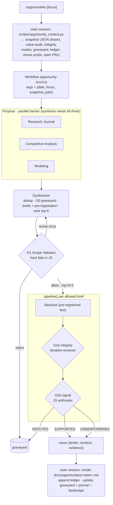
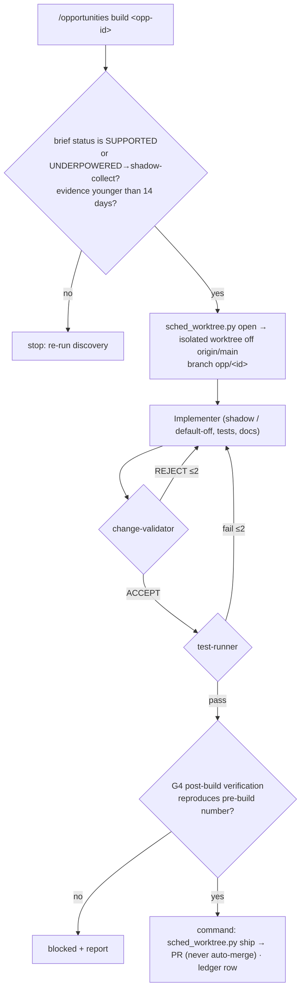

# Opportunity Scout — agentic workflow scope

Status: **BUILT** (Phases 1–4) · scoped 2026-10-09, built 2026-10-10 · branch `claude/agentic-workflow-opportunities-f8af15`

## Build status (2026-10-10)

| Piece | File |
|---|---|
| Command | `.claude/commands/opportunities.md` (`/opportunities [focus]`, `build <id>`, `status`) |
| Discovery graph | `.claude/workflows/opportunity-scout.js` |
| Build graph | `.claude/workflows/opportunity-build.js` |
| Project agents | `.claude/agents/opportunity-{researcher,competitor,modeler,validator}.md`, `evmax-backtester.md` |
| Context snapshot | `scripts/opportunity_context.py` |
| Ledger / report / graveyard writer | `scripts/opportunity_ledger.py` |
| Graveyard seed (46 entries) | `docs/opportunities/graveyard.yaml` |
| Read-only DB switch | `evmax/db_location.py` (`EVMAX_DB_DIR`, `EVMAX_DB_READONLY`) |
| Board JSON | `evmax cleanup shadow board --json` |
| Tests | `tests/test_opportunity_{workflows,ledger,context}.py`, `tests/test_db_location.py`, `tests/workflow_harness.mjs` |

Changes from the scope below, decided during the build:

1. **Read-only access is an env switch in evmax**, not a per-agent patch. Every DB-reading command
   an agent runs from a worktree takes `EVMAX_DB_DIR=<main>/data EVMAX_DB_READONLY=1`.
2. **The command owns the worktree and the PR.** `sched_worktree.py open` runs before the build
   graph and `sched_worktree.py ship` after it, so no Dispose agent exists and the graph never
   touches git. The build graph returns `pr_title` / `pr_body`.
3. **Results are ingested from the Workflow task output file**, so no model retypes JSON. The
   build graph receives a compact `gate` object printed by `opportunity_ledger.py get --gate`.
4. **A `BLOCKED` build may be retried** while its discovery evidence is ≤ 14 days old.
5. The metric rules exist once per graph between `METRIC_RULES:BEGIN/END` markers; a test pins the
   two copies equal and the Python validator parses the same block.
6. Phase 5 (scheduling) is not set up. The golden replay (§9.1) has not been run; it needs a live
   discovery run.

## 1. Goal

When the owner asks for "new potential opportunities", one command runs a fixed, versioned
multi-agent graph. The graph finds candidate edges from three independent angles, gates each
candidate for scope, tests it offline against a pre-registered metric, and — only on request —
builds the winner as a shadow-only pull request.

| Command | Run type | Result |
|---|---|---|
| `/opportunities [focus]` | **Discovery** | Ranked Opportunity Briefs, each with a scope verdict and offline evidence. Writes a report to `docs/opportunities/<date>.md`. No code changes. |
| `/opportunities build <opp-id>` | **Build** | One pull request (never auto-merged). The change enters as shadow or behind a default-off flag, with tests and a post-build verification report. |

`focus` is optional free text, for example `nfl props`, `execution`, `new venues`, or `ncaaf`.
An empty focus means the whole project.

### Why two runs instead of one

1. **Agent count.** The session guideline is fewer than 10 agents per workflow. Discovery needs
   about 9 agents and build needs about 5. One combined run would need about 14–20.
2. **Build cost varies widely.** A new sector costs far more than a calibration change. The owner
   picks which supported brief is worth building.
3. **Precedent.** The `model-improve` graph already uses the rule "the graph proposes, a human
   merges". The pick step adds a second human control point before the expensive stage.

## 2. Design principles

Each principle comes from a lesson already recorded in this repository.

1. **The orchestrator is deterministic.** The Workflow script owns control flow, budgets, and
   gate arithmetic. LLM agents propose and judge. They never decide which stage runs next. An LLM
   orchestrator could rationalize skipping a gate. JavaScript cannot.
2. **Proposers never judge their own ideas.** The research, competitive, and modeling agents are
   separate from the validator, the backtester, and the reviewer.
3. **Every brief is pre-registered.** Before any backtest runs, the brief fixes the metric, the
   pass threshold, the data window, the holdout, and the minimum sample. The backtester cannot
   change these values. This blocks metric fishing.
4. **An edge names a mechanism and a market lens.** The brief must say who is on the other side
   and why the price is wrong. The primary metric is CLV or ROI **net of fees**. A Brier-only gain
   is not enough: at sharp weight 0.85 the anchor absorbs it (NCAAF v2: −1.1/1000 standalone,
   ≤0.4/1000 in the blend). The 2026-10-07 gate check found CLV gates that pass gross of fees
   and fail net of fees.
5. **Rejected ideas are remembered.** A graveyard file records every rejected or refuted idea
   with a `revisit_if` condition. The validator rejects a re-proposal unless it cites new evidence
   that meets that condition. CLAUDE.md alone holds 10 "REJECTED" verdicts and 7 docs hold more.
6. **Shadow first.** A build enters as `mode='shadow'`, a new shadow market type, or a
   default-off flag. The workflow never flips a category mode, never edits live
   `data/models/*_state.json` or `data/model_config.json`, and never merges.
7. **The existing safety rules apply unchanged.** These are the `GIT_SAFETY` block from
   `model-improve.js`, targeted tests only (the full suite mutates state files), and read-only
   database access.

## 3. Agent roster

| # | Role | Agent type | Tools | Writes to repo? | Count per run |
|---|---|---|---|---|---|
| 0 | **Orchestrator** | Workflow script `.claude/workflows/opportunity-scout.js` and `opportunity-build.js` | (control flow only) | No | — |
| 1 | **Research Journal** | new project agent `opportunity-researcher` | Read, Grep, Glob, WebSearch, WebFetch | No | 1 (option: 2) |
| 2 | **EV Competitive Analysis** | new project agent `opportunity-competitor` | Read, Grep, Glob, WebSearch, WebFetch | No | 1 |
| 3 | **Modeling** | new project agent `opportunity-modeler` | Read, Grep, Glob, Bash (read-only) | No | 1 |
| 4 | **Synthesizer** (orchestrator's judgment node) | `general-purpose` | Read, Grep, Glob | No | 1 (+1 on revise) |
| 5 | **Scope Validator** | new project agent `opportunity-validator` | Read, Grep, Glob, Bash (read-only) | No | 1 (+1 on revise) |
| 6 | **Verification & Backtest** | new project agent `evmax-backtester` | Read, Grep, Glob, Bash, Write (scratchpad only) | No (discovery) | up to 2 |
| 7 | **Backtest integrity** | existing global `iteration-reviewer` | Read, Grep, Glob, Bash | No | up to 2 |
| 8 | **Implementer** | existing global `implementer` | Read, Grep, Glob, Bash, Edit, Write | Yes (isolated worktree) | 1 (+≤2 fix loops) |
| 9 | **Code reviewer** | existing global `change-validator` + evmax checklist | Read, Grep, Glob, Bash | No | 1 (+≤2) |
| 10 | **Test stage** | existing global `test-runner` | Read, Grep, Glob, Bash, Edit, Write | Tests only | 1 (+≤2) |
| 11 | **Post-build verification** | `evmax-backtester` in post-build mode | as #6 | No | 1 |
| 12 | **Dispose** | the `/opportunities` command itself (`sched_worktree.py ship`) | git, `gh` | Commit + PR | — |

Agents 1–7 run in discovery. Agents 8–11 run in build; step 12 is the command, not an agent.

**Security boundary.** The two web-facing agents (1, 2) get no Bash, Edit, or Write tools.
Fetched web content can carry prompt-injection text. An agent without shell or write access
cannot act on it. Any network probe of our own venues (for example
`scripts/check_kalshi_series.py --probe`) runs in the context script instead, before the agents
start.

### 3.1 Research Journal agent

**Job:** find published or practitioner evidence for edges that evmax does not yet use, and keep
a running journal so later runs read new work instead of re-reading old work.

- **Sources:** arXiv (stat.AP, q-fin.TR, cs.LG), SSRN, *Journal of Prediction Markets*,
  *Journal of Quantitative Analysis in Sports*, *Journal of Sports Analytics*, *International
  Journal of Forecasting*, MIT Sloan Sports Analytics Conference papers, plus this repo's own
  `docs/*-eval.md`.
- **Lenses** (when run with 2 instances): (a) market microstructure — favorite–longshot bias,
  maker/taker economics, closing-line efficiency, prediction-market liquidity; (b) sports
  modeling — ratings, player props, injuries, in-season priors.
- **Rules:** every finding carries a fetched URL or DOI. A finding without one is dropped by the
  synthesizer. Quotes stay under 15 words. The agent checks `already_in_evmax` against CLAUDE.md
  and the graveyard before it proposes anything.
- **Output fields:** `title`, `citation`, `url`, `claim`, `effect_size`, `data_needed`,
  `maps_to_lever`, `sectors`, `replicability` (A/B/C), `already_in_evmax`, `novelty_note`.
- **Journal memory:** `docs/research-journal/sources.jsonl` records every source read (URL, date
  read, relevance, mapped lever). The next run skips sources already in the file.

### 3.2 EV Competitive Analysis agent

**Job:** compare evmax against other +EV projects and against the venue landscape, and turn the
gaps into candidates.

- **Scope:** (a) commercial +EV and sharp-line tools; (b) open-source projects (Kalshi and
  Polymarket bots, market makers, EV finders on GitHub); (c) venue changes — new Kalshi series
  and Polymarket US leagues that evmax does not wire, new exchanges, fee schedule changes. Part
  (c) reads the venue-probe results that the context script already collected.
- **Rules:** public pages only. No logins, no account creation, no paywall bypass, and no
  scraping behind anti-bot pages (the ufcstats.com rule). Summaries only, no copied text.
- **Output fields:** `competitors[]` (`name`, `type`, `url`, `approach`, `has_we_lack`,
  `we_have_they_lack`), `venue_gaps[]` (series or league, observed volume, wiring cost), and
  `candidates[]`.
- **Memory:** `docs/competitive/landscape.md` holds the latest snapshot. The next run reports the
  diff against it.

### 3.3 Modeling agent

**Job:** find opportunities inside evmax's own measurements.

- **Inputs** (all from the context snapshot): `cleanup value-audit --json`, the promotion board,
  `cleanup shadow clv-prices` per sector, `cleanup integrity --json`, model why-not blockers from
  `shadow show --why`, and the CLAUDE.md modeling table.
- **What it looks for:** lanes at SHARP-PASSTHROUGH that have a plausible model lever, data
  already collected but unused, calibration bias by price bucket, models that are often
  "missing" from blends, and market types that are wired but shadow without a promotion plan.
- **Difference from `model-improve`:** `model-improve` fires only on an actionable value-audit
  gap and only reweights or recalibrates. The modeling agent proposes wider levers: new model
  families, new features, new market types, and new data sources. It does not implement.
- **Output fields:** `candidates[]`, each with an internal evidence pointer (the exact command and
  the numbers it printed).

### 3.4 Synthesizer

The synthesizer is the orchestrator's only LLM judgment node. It does four things:

1. Merges and deduplicates candidates from the three proposers.
2. Drops candidates that match a graveyard entry without new evidence (first-pass G0).
3. Writes each survivor as an **Opportunity Brief** (Section 5), including its pre-registration.
4. Ranks the briefs by expected value per unit of build effort and passes the top K (default 5)
   to the validator. The script logs every brief it drops at this cap ("no silent caps").

### 3.5 Scope Validator

The validator decides `allow`, `revise`, or `reject` for each brief. It is read-only and judges
all K briefs in one call, so it can compare them.

**Hard fails** are returned as booleans. The script rejects a brief if any is true; the LLM cannot
override them.

| Hard fail | Example from this repo |
|---|---|
| `requires_auth_or_account` | Novig and ProphetX market data need an authenticated account |
| `requires_antibot_bypass` | ufcstats.com JS interstitial |
| `requires_tos_violation_or_paywall` | — |
| `touches_live_pricing_without_flag` | NBA/NCAAB/NCAAW spreads and live moneylines |
| `changes_bankroll_or_mode` | mode flips, Kelly caps, live promotion |
| `no_measurable_signal` | no offline test and no shadow lane can measure it |
| `in_graveyard_without_new_evidence` | per-league Poisson `league_avg`, Elo H2H, near-close rescan |
| `edits_eval_or_holdout` | any metric-gaming shape |

**Scored criteria** (0–3 each): edge-mechanism clarity · net-of-fee viability · data
availability · time to evidence (weeks to reach n≥30 independent games) · build size (S/M/L) ·
architecture fit (parallel stacks rule, registry rules, testing policy) · upside (volume × edge).

`revise` sends the brief back to the synthesizer once with the validator's required changes. A
second `revise` becomes `reject`.

### 3.6 Verification & Backtest agent

The same agent runs in two modes.

**Pre-build mode (discovery, gate G2).** The agent runs the brief's pre-registered test with
existing tools: `evmax backtest run`, `scripts/backtest_*.py` (32 scripts exist),
`cleanup shadow clv | clv-prices | board`, `cleanup listings-eval`, and archive replays. It may
write throwaway scripts in the scratchpad only.

Rules it must follow:

- Reads the main checkout's `data/archive.db` (5.7 GB) and `data/predictions.db` through
  read-only `mode=ro` URIs. A worktree has no databases, and the CLI silently creates an **empty**
  `archive.db` there (the 2026-10-07 gotcha that excluded 100% of rows).
- Walk-forward only, with the train and holdout windows from the pre-registration.
- Runs a leakage checklist: UTC vs ET game dates (the NFL backtest leak fixed 2026-10-06),
  point-in-time features, and no future closes.
- Counts independent games, not rows or rungs (the NFL spread declustering lesson).
- Reports the pre-registered metric verbatim. Extra diagnostics are labeled "secondary".

**Post-build mode (build, gate G4).** The agent re-runs the same pre-registered test through the
**implemented code path**, not the prototype script. The result must reproduce the pre-build
number: same sign, and inside the pre-build confidence interval.

### 3.7 Implementation and review

The request named "an implementation and review agent". This scope splits that role into three
agents, because an agent that reviews its own code is the weakest form of review:

1. `implementer` writes the smallest vertical slice in an isolated worktree, behind shadow or a
   default-off flag, with tests (Testing Policy) and the CLAUDE.md updates the change requires.
2. `change-validator` reviews the diff read-only for correctness, regressions, conventions, and
   reward hacking, plus an evmax checklist: YES-side alignment, ET/UTC game day, `:no`-side
   conventions, `ev_pct` stored as a fraction, venue firewall, shadow mode, contamination rules,
   declared `state_filename`, `MIN_NONSHARP_MODELS` and `REQUIRED_BLEND_MODELS`.
3. `test-runner` runs targeted tests and adds the missing test for the new behavior.

A REJECT from either reviewer routes back to the implementer, at most twice. A third failure ends
the run as `blocked` with the reasons.

## 4. Flow

### 4.1 Discovery

### 4.2 Build

`UNDERPOWERED` is a valid build input only for a **shadow-collect** build: a change whose sole
purpose is to log shadow rows so that a later run has enough sample. It never adds live pricing.

## 5. Opportunity Brief (the edge contract)

Every agent boundary passes this object, validated by JSON schema at the tool-call layer.

| Field | Content |
|---|---|
| `id` | `<slug>-<YYYYMMDD>` |
| `lever` | `model` · `pricing` · `execution` · `coverage` (new market, sector, or league) · `venue` · `data` · `reliability` |
| `sectors`, `market_types`, `venues` | scope of the change |
| `hypothesis` | one sentence |
| `edge_mechanism` | who is on the other side, and why the price is wrong |
| `sources[]` | `{kind: research \| competitive \| internal, ref}` |
| `data[]` | `{name, public, auth_required, access_method, cost}` |
| `preregistration` | `metric`, `threshold`, `min_n_games`, `train_window`, `holdout_window`, `comparator`, `command`, `declustering` |
| `size` | S / M / L, plus files likely touched |
| `risks`, `blast_radius` | including which live lanes it could touch |
| `graveyard_check` | `{matched_ids, why_different}` |
| `status` | `proposed → scoped → evidence → building → pr_open → merged \| abandoned` |

**Allowed primary metrics:**

| Metric | Use for | Pass rule (default) |
|---|---|---|
| `clv_pp_net_fee` | pricing, execution, coverage | mean > 0, game-declustered z ≥ 1.64, n ≥ 30 games |
| `roi_net_fee` | execution with fill data | as above |
| `open_close_slope` | model levers | slope of (close − open) on (model − open) > 0 with t ≥ 2 (the NCAAF v2 lens) |
| `brier_paired_vs_sharp` | screening only | Δ ≤ −2/1000 and z ≤ −1.64; **must** be paired with a CLV promotion plan |
| `match_rate` / `coverage` | reliability, matching | pre-registered absolute target on an archive replay |

A brief may tighten a default threshold. It may not loosen one.

## 6. Gates

| Gate | Stage | Decided by | Pass | Fail route |
|---|---|---|---|---|
| G0 Novelty | synthesizer, then validator | graveyard lookup | not in graveyard, or new evidence meets `revisit_if` | reject → noted in report |
| G1 Scope | validator | hard fails in JS; scores by LLM | `allow` | `revise` once, then `reject` → graveyard |
| G2a Integrity | after backtest | `iteration-reviewer` | pre-registration honored, no leakage | `INVALID` → report (no re-run in the same run) |
| G2b Signal | after G2a | JS arithmetic | `SUPPORTED`; `UNDERPOWERED` when n < `min_n_games` | `REFUTED` → graveyard |
| Pick | between runs | owner | `/opportunities build <id>` | — |
| G3 Review | build | `change-validator` + `test-runner` | ACCEPT and targeted tests pass | ≤2 fix loops, then `blocked` |
| G4 Verify | build | `evmax-backtester` post-build | reproduces pre-build result; shadow or default-off confirmed | `blocked` |
| G5 Merge | PR | owner | — | — |

G2a runs **before** G2b, the same order as `model-improve`. An integrity check that runs after
the number is known invites rationalizing a good number.

## 7. Persistence

| Artifact | Path | Tracked? | Writer |
|---|---|---|---|
| Context snapshot | `docs/opportunities/context/<date>.json` | No (gitignored) | `scripts/opportunity_context.py` |
| Run report | `docs/opportunities/<date>.md` | Yes | main session via `scripts/opportunity_ledger.py render` |
| Ledger | `docs/opportunities/ledger.jsonl` | Yes | `scripts/opportunity_ledger.py append` |
| Graveyard | `docs/opportunities/graveyard.yaml` | Yes | seeded once, then `opportunity_ledger.py graveyard-add` |
| Research journal | `docs/research-journal/sources.jsonl` + monthly `.md` | Yes | main session from research output |
| Competitive landscape | `docs/competitive/landscape.md` | Yes | main session from competitive output |

**Why a new tracked ledger instead of `.claude/improvement-ledger.jsonl`:** that file is
gitignored (`.gitignore` ignores `.claude/*` and re-includes only `commands/` and `workflows/`).
A run in a worktree writes to the worktree's copy, and the row never reaches the main checkout.
A tracked file under `docs/` travels with the PR and can be reviewed.

**Discovery agents never write to the repo.** The workflow returns structured data. The main
session writes every file after the workflow ends, through one deterministic script. A clean
`git status` after the workflow (before the render step) is an acceptance check.

## 8. Implementation plan

### Phase 1 — Deterministic foundations (no agents)

1. `docs/opportunities/graveyard.yaml`: seed about 40 entries from the CLAUDE.md REJECTED
   verdicts, `docs/*-eval.md`, `docs/value-audits/`, and the owner's memory notes. Each entry has
   `id`, `idea`, `lever`, `sectors`, `verdict`, `evidence` (doc or PR), `revisit_if`.
2. Add `--json` to `evmax cleanup shadow board`. Today only `cleanup value-audit` and
   `cleanup integrity` emit JSON; the board exists only as a table and as the dashboard endpoint.
3. `scripts/opportunity_context.py`: build the snapshot (effective modes, board JSON, value-audit
   JSON, integrity JSON, recent ledger rows, graveyard, open PRs via `gh pr list`, eval-doc index,
   Kalshi series probe). Open the main-checkout databases with read-only URIs.
4. `scripts/opportunity_ledger.py`: `append`, `render`, `status`, `graveyard-add`, and brief
   schema validation.
5. Tests: `tests/test_opportunity_ledger.py`, `tests/test_opportunity_context.py`, and a board
   `--json` test.

### Phase 2 — Agent definitions

1. Add `!.claude/agents/` to `.gitignore` so project agents are versioned (the same fix PR #157
   made for `workflows/`).
2. Create `.claude/agents/opportunity-researcher.md`, `opportunity-competitor.md`,
   `opportunity-modeler.md`, `opportunity-validator.md`, and `evmax-backtester.md`.
3. Reuse the global `implementer`, `change-validator`, `test-runner`, and `iteration-reviewer`
   unchanged. The evmax review checklist goes in the build workflow's prompt, not in the global
   agent file.

### Phase 3 — Discovery workflow

1. `.claude/workflows/opportunity-scout.js` with the schemas in Section 5.
2. `.claude/commands/opportunities.md`: runs the context script, calls the Workflow (the command's
   instruction is the explicit opt-in the Workflow tool requires), then renders the report.
3. Validate on a narrow focus first (for example `focus: nfl props`).

### Phase 4 — Build workflow

1. `.claude/workflows/opportunity-build.js`, using `scripts/sched_worktree.py open/ship`
   (non-rolling) for the isolated worktree and the PR.
2. First build: a small `SUPPORTED` brief from a Phase 3 run.

### Phase 5 — Optional scheduling

A report-only discovery run every two weeks, modeled on `biweekly-model-improve-graph`. Builds are
never scheduled.

## 9. Acceptance criteria for the workflow itself

1. **Golden replay.** Mask five historical decisions in the graveyard and feed them in as
   candidates. The validator and backtester must reproduce the recorded verdicts. Proposed set:
   NFL depth-chart QB starters (shipped, blend 0.2232 → 0.2190 on changed-starter games);
   NCAAF ESPN win-probability garbage-time filter (rejected, +15–19/1000 worse); MLS disagreement
   ramp (refuted); Elo H2H via resolved keys (rejected in every sector); NFL Elo rest table
   (rejected).
2. **Graveyard recall.** Three un-masked graveyard ideas submitted as new candidates are all
   rejected at G0 or G1.
3. Every brief that reaches G1 has a complete pre-registration.
4. Discovery leaves `git status` clean until the render step.
5. Every cap (top K, top N) is logged with the dropped items.
6. A build run opens a PR, never merges it, and the validator confirms shadow or default-off.

## 10. Risks

| Risk | Mitigation |
|---|---|
| Idea recycling | Graveyard + G0, with `revisit_if` |
| Invented citations | URL or DOI required; synthesizer drops findings without one |
| Backtest p-hacking | Pre-registration; G2a before G2b; one test per brief per run |
| Empty worktree database | Read-only URIs into the main checkout |
| Shared-checkout damage | `GIT_SAFETY`; builds only in isolated worktrees |
| Prompt injection from the web | Web agents have no shell or write tools |
| Fee blindness | Net-of-fee metrics are the only allowed CLV/ROI form |
| Web tools missing in headless runs | Research and competitive agents return `unavailable`; the run continues on the modeling agent |
| Cost growth | Defaults K=5, N=2, one research agent; caps logged |

## 11. Open decisions

| # | Decision | Recommendation |
|---|---|---|
| 1 | Human pick between discovery and build, or auto-build the top `SUPPORTED` S-size brief | Human pick |
| 2 | Implementation + review as one agent or three | Three (implementer, change-validator, test-runner) |
| 3 | Research agents per run | 1, with a `--research 2` option |
| 4 | Schedule discovery | Manual for the first two runs, then biweekly report-only |
| 5 | Graveyard location | Tracked repo file `docs/opportunities/graveyard.yaml` |
